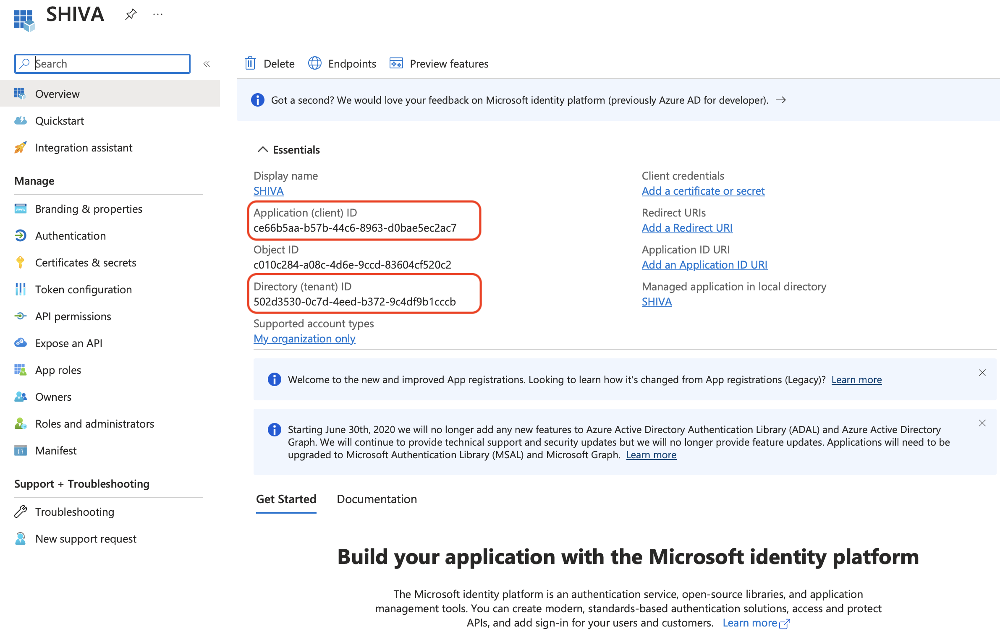

Here is an example of configuring an authentication repository for a Cloud Temple organization with __Microsoft EntraID__ (Azure Active Directory).

The configuration of your Microsoft repository at the level of a Cloud Temple organization facilitates the authentication of your users on the Shiva console. This avoids the multiplication of authentication factors and reduces the attack surface.

If your users are authenticated to their Microsoft account, authentication to Shiva console services will be seamless.

Here are the different steps to perform this configuration:


## Step 1: Configuration of SSO on the Microsoft Azure side

### Registering a new Azure application (Azure portal)
To create the __app registration__, go to the Microsoft Azure portal, then to Microsoft EntraID, __"ADD > App Registration"__

On the "Register an application" page, please indicate:
```
- __Name__: Indicate "__SHIVA__"
- __Supported account types__: __Accounts in this organizational directory only__ (__<Your Azure Tenant>__ only - Single tenant)
- __Redirect URL__: Do not configure this initially. The URL will be provided by Cloud Temple support and should be added to this field later.
```


The information **Application (client) ID** and **Directory (tenant) ID** are the useful details to provide when requesting support from the Cloud Temple team to enable Microsoft EntraID authentication at your organization.



### Defining a secret
In the "Certificates & secrets" tab, create a new secret.
*Note: The secret's expiration date cannot exceed 24 months, even with a custom expiration date.*


The generated secret must be provided in the support request:


### EntraID Token Definition

The EntraID token is required for authentication configuration.

In the __"Token Configuration"__ menu, click on __"Add optional claim"__. You will need to select "ID" as the token type and check "email".


The Azure interface will ask if you want to add a permission that will allow you to read a user's email (Microsoft Graph email), check the box and confirm.


Next, go to "API permissions" and click on __"Grant admin consent for Cloud Temple"__.


### Additional Security Configurations (optional but recommended)
By default, Microsoft EntraID as configured will grant any user in your Azure tenant the ability to log into your Cloud Temple organization. 
It is possible to restrict access at the __"App Registration"__ level to allow only a list of users or groups to connect to your Cloud Temple organization.

Here's the procedure to follow:

#### Access the "App Registration" additional settings
##### Option 1
Go to the "Overview" tab and click on the application name (the link located next to "Managed application").


##### Option 2
Go to "Enterprise applications" and search using the name of the previously created application.


#### Restricting authentication to users assigned to the application

Indicate here the need for user assignment to the application to authorize their authentication:


#### Assignment of Users and Groups to the Application
Only the groups and users assigned to the application will be able to connect to your Cloud Temple organization via the app registration.


Finally, you just need to apply the assignment by clicking on "Assign".


From now on, the users assigned to the application will be able to connect to your Cloud Temple organization via the created application.

## Step 2: Request the Configuration of the SSO (Single Sign-On) for Your Organization

This part of the configuration is done at the organizational level by the Cloud Temple team.

To do so, make __a support request__ in the console indicating your intent to configure a Microsoft EntraID SSO.

Please provide the following information in the support request:

    Your Organization Name
    The name of a contact with their email and phone number to finalize the configuration
    Application ID (unique identifier associated with the previously created application)
    Directory ID (corresponds to the Azure AD identifier of the Azure tenant)
    Secret (Secret associated with the previously created application)

Once the configuration is completed on the Shiva console, the indicated contact will be informed.

## Step 3: Finalizing the Configuration

On the App Registration homepage, in the overview menu, click on "Add a Redirect URL".


Next, go to "Add a platform" and add a Web platform.


You simply need to enter the "Redirect URL" provided by the Product Applications Team.


You should get this result once the "Redirect URL" has been added.


The configuration of the "Redirect URL" may take a few minutes to become effective.
Once all the steps are completed, you can authenticate to your Cloud Temple organization via your SSO.

