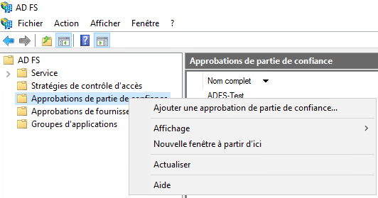
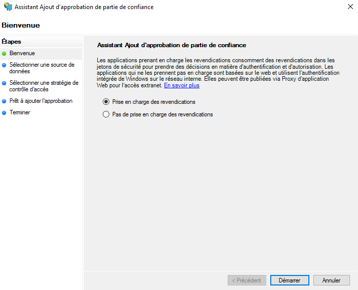
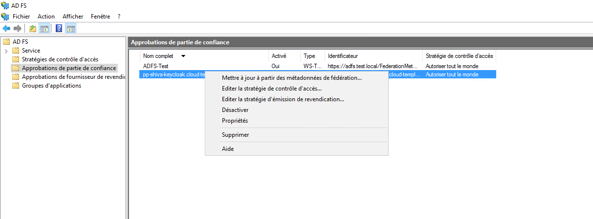

Here is an example of configuring the authentication repository of a Cloud Temple organization with __Microsoft ADFS__.

Configuring your Microsoft repository at the level of a Cloud Temple organization facilitates the authentication of your users on the Shiva console.
This helps to avoid the multiplication of authentication factors and to decrease the attack surface.
If your users are authenticated to their Microsoft account, authentication to the services of the Shiva console will be seamless.

Here are the different steps to achieve this configuration:


## Prerequisites
Your Microsoft ADFS server must be able to access the following Cloud Temple URL: https://keycloak-shiva.cloud-temple.com/auth/.

The ADFS must be accessible from the Cloud Temple networks and __expose a TLS certificate from a public CA__.
Users wishing to connect to the portal must have their email, first name, and last name specified in the Active Directory.

## Step 2: Request your organization's SSO (Single Sign-On) configuration

This part of the configuration is done at the organization level by the Cloud Temple team.

To do this, make a __support request__ in the console indicating your desire to configure your Microsoft ADFS authentication repository.

Please provide the following information in the support request:
```
    Your Organization's name
    The name of a contact with their email and phone number to finalize the configuration
    Public URL of the ADFS federation Metadata (<adfs domain name>/FederationMetadata/2007-06/FederationMetadata.xml)
    (Example: https://adfs.test.local/FederationMetadata/2007-06/FederationMetadata.xml)
```
As soon as the configuration is completed on the Shiva console side, the indicated contact will be informed.
The Cloud Temple support team will provide you with a URL that will look like this: https://keycloak-shiva.cloud-temple.com/auth/realms/companytest/broker/adfs_test/endpoint/descriptor

*You can paste the URL into a browser to test it. If it works correctly, you should see an XML display.*

## Step 3: Implementing the ADFS configuration
### Configuring the authentication federation

#### Adding a trusting party approval

On your ADFS server, go to __"Add a trusting party approval"__.



### Configure the "claims"
Claims provide information to the token that will be transmitted to the Cloud Temple console. 

They transmit the necessary information of the connected user for the proper functioning of the various services, such as their email, first name, and last name.


Select "Import data, published online or on a local network, regarding the trust party" and fill in the URL provided by Cloud Temple support.


You can provide a name and description for the trust party, this part is optional.


By default, we authorize everyone but it is possible to select __"Authorize a specific group"__ to select the group or groups that will be allowed to access the services of the Shiva console via ADFS.


Once all these steps are completed, you have finished setting up the trust party.


You will then need to edit the claim issuance policy for this new trust party.



Click on "Add a rule" and specify the template, either "Transform an incoming claim".


You will only need to fill in the information as indicated in the screenshot below.


### Add the claims
Add a second rule, this time using the "Send LDAP Attributes as Claims" template.


Select the attribute store and add the "E-Mail Addresses, Given-Name, Surname, and SAM-Account-Name" attributes as shown in the screenshot below.


You just need to apply the changes.

## Step 3: Finalization

You can now test by going to the Shiva console and clicking on the button corresponding to the ADFS client authentication; in this example, it is __"ADFS Test"__

