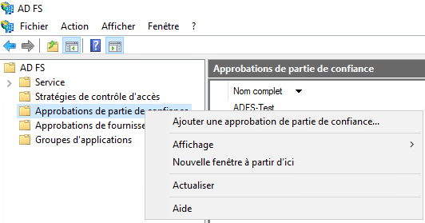
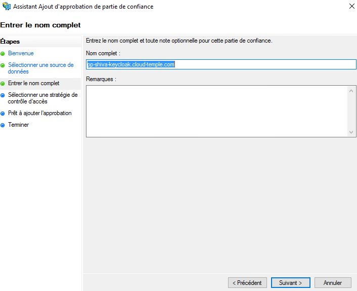
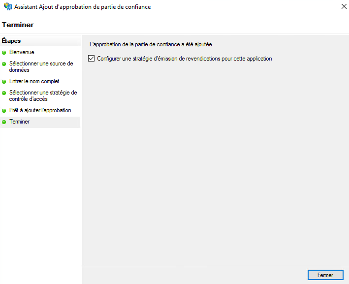
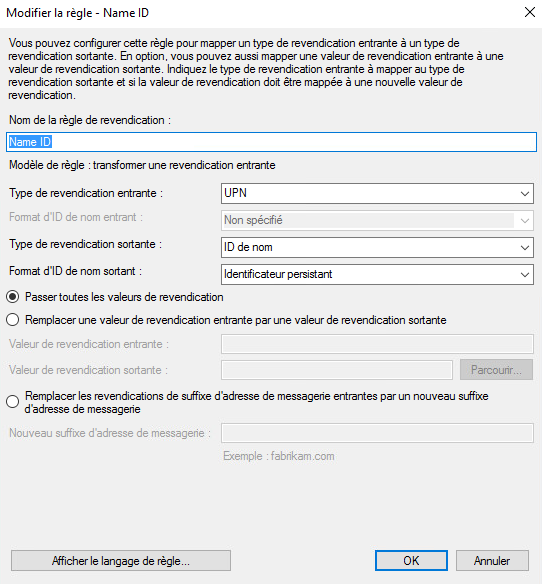
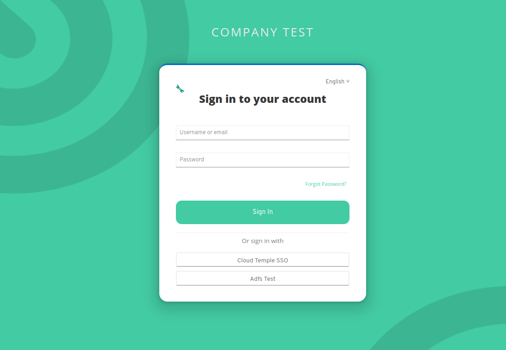

Here is an example of configuring the authentication repository of a Cloud Temple organization with __Microsoft ADFS__.

Configuring your Microsoft repository at the Cloud Temple organization level facilitates user authentication on the Shiva console.
This helps avoid multiplying authentication factors and reduces the attack surface.
If your users are authenticated to their Microsoft account, authentication to Shiva console services will be seamless.

Here are the various steps to perform this configuration:


## Prerequisites
Your Microsoft ADFS server must be able to access the following Cloud Temple URL: https://keycloak-shiva.cloud-temple.com/auth/.

The ADFS must be accessible from Cloud Temple networks and __expose a TLS certificate from a public CA__.

Users wishing to log in to the portal must have their email, first name, and last name filled in on the Active Directory.

## Step 2: Request Single Sign-On (SSO) configuration for your organization

This part of the configuration is done at the organization level by the Cloud Temple team.

To do this, make a __support request__ in the console indicating your desire to configure your authentication repository with Microsoft ADFS.

Please provide the following information in the support request:
```
    The name of your Organization
    The name of a contact with their email and phone number to finalize the configuration
    Public URL of the ADFS federation Metadata (<domain name of the adfs>/FederationMetadata/2007-06/FederationMetadata.xml)
    (Example: https://adfs.test.local/FederationMetadata/2007-06/FederationMetadata.xml)
```
As soon as the configuration is completed on the Shiva console side, the indicated contact will be informed.

The Cloud Temple support team will send you a URL similar to this one: https://keycloak-shiva.cloud-temple.com/auth/realms/companytest/broker/adfs_test/endpoint/descriptor

*You can paste the URL into a browser to test it. If it works correctly, you should see an XML displayed*

## Step 3: ADFS Configuration
### Authentication Federation Configuration

#### Adding a Relying Party Trust

On your ADFS server, go to __"Add a Relying Party Trust"__.



### Configure the "claims"
Claims provide information to the token that will be sent to the Cloud Temple console.

They transmit the connected user's information necessary for the proper functioning of the various services, such as their email, first name, and last name.


Select "Import data about the relying party published online or on a local network" and enter the URL provided by the Cloud Temple support.


You can provide a name and description for the relying party trust; this part is optional.



By default, we allow everyone but it is possible to select __"Permit only specific groups"__ to select the group(s) that will be allowed to access Shiva console services via ADFS.


Once all these steps are completed, you have finished configuring the relying party trust.



You will then need to edit the claim issuance policy for this new relying party trust.


Click on "Add Rule" and specify the template, which is "Transform an Incoming Claim".


You then just need to fill in the information as shown in the screenshot below.



### Add the claims
Add a second rule this time with the template "Send LDAP Attributes as Claims".


Select the attribute store and add the attributes "E-Mail Addresses, Given-Name, Last Name, and SAM-Account-Name" as shown in the screenshot below.


You just need to apply the changes.

## Step 3: Finalization

You can now test by going to the Shiva console and clicking on the button corresponding to the ADFS client authentication; in this example, it is __"ADFS Test"__

