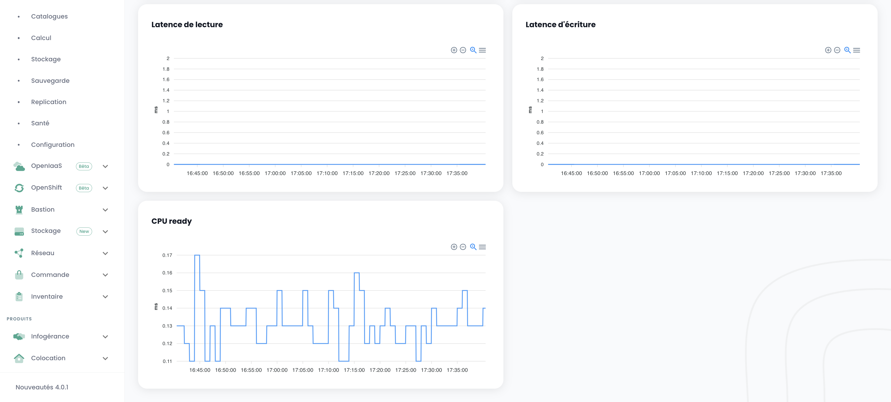
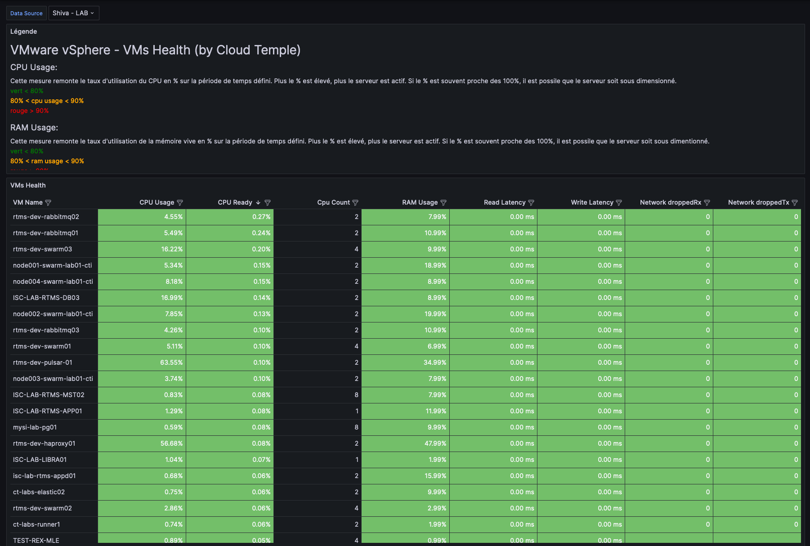

## Concept

The majority of __Cloud Temple__ clients have visualization, monitoring, and metrology tools for tracking their operations. 

The philosophy of the Shiva console is to allow access to data to integrate into this tooling via an integrated prometheus proxy. 

This proxy allows you to query and manipulate data from a visualization tool like [Grafana](https://grafana.com).

However, it is possible to view some performance data of your Cloud resources in the Shiva console web interface.

*__Note:__ The __Cloud Temple__ philosophy is not to integrate multiple graphs into the web interface, but to offer the maximum information accessible via the API.*

## Dashboard integrated into the web interface

*__Note:__ To access these dashboards, it is necessary to have the __'metric_read'__ right.*

### Monitoring carbon emissions for computing

The Shiva console dashboard by default includes a graph for monitoring the power consumption of your computing resources and the associated carbon emission estimate.

It is directly accessible on the homepage of the Cloud Temple console web interface, by clicking on __'Metric'__:

### Global view of the virtual machines' health

The summary of the virtual machines' state is accessible in the __'IaaS'__ menu on the left of your screen, in the __'Health'__ submenu and then __'Virtual Machines'__

This summary provides, over the selected time range in __'Filters'__:

- the number of CPUs and the __average CPU usage__, 
- the number of GB of memory and the __average memory usage__, 
- The averages of __storage access latency__ for reading and writing,
- The average __'CPU Ready'__ of the virtual machine (which corresponds to the average wait time for the availability of a physical core by the virtual machine).

For each VM, you can access its performance history by clicking on the green __'History'__ icon of the virtual machine in the action column.:

You will then have access to the graphical visualization page of the historical data, including an __environmental performance__ view:

## Usage with __Grafana__

It is possible for the Shiva console to serve as a __datasource__ for your [Grafana](https://grafana.com) infrastructure.

You will find a whole set of __Grafana configuration examples__ here:

https://github.com/Cloud-Temple/console-grafana-iaas

