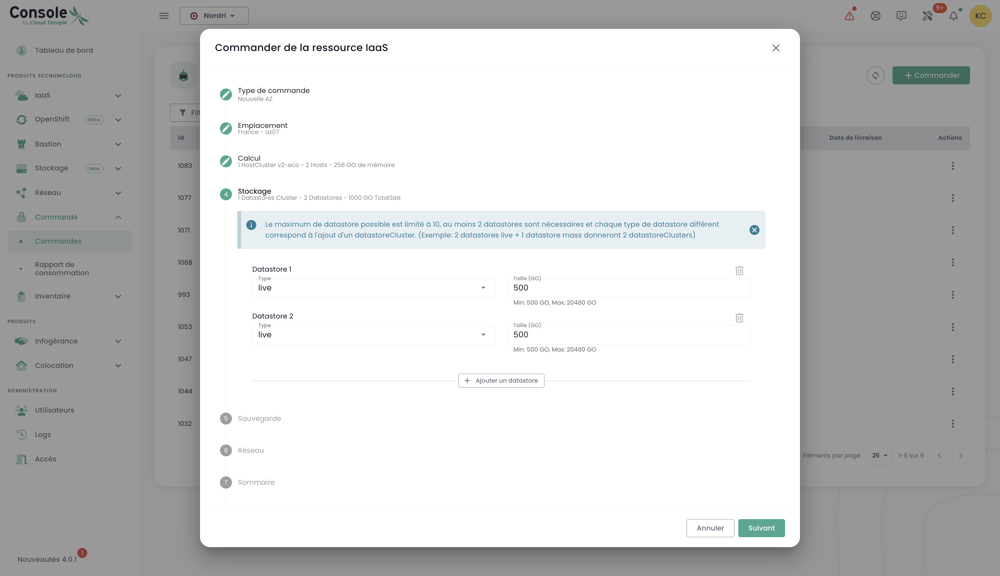

## Concept

Deployment tracking of new resources is done in the __'Orders'__ menu accessible from the green sidebar on the left side of the screen.

It allows you to view the Cloud resources ordered, currently being deployed, and any potential errors within a [tenant](tenants.md) of your [Organization](organisations.md).

*__Note: At this time, a global view at the organization level of all deployed resources across different tenants is not yet possible.__ This matter will be addressed in 2024 with the implementation of a dedicated portal for the sponsor (signatory) and the management of their organization.*

The deployment or deletion of resources is done within each product in the __'IaaS'__ and __'Network'__ menus on the left side of the screen in the green sidebar.
It is also possible to directly see deliveries within the notifications of the Cloud Temple console:

From the orders page, you can see the progress of a delivery and possibly communicate with the team by providing comments or details:

**Note**: **It is not possible to launch multiple orders of the same type of resource simultaneously. Therefore, you must wait until the current order is processed and completed before placing a new one. This ensures efficient and orderly resource management within your environment.**

## Ordering a new availability zone

It is possible to add a new availability zone by accessing the "**Order**" menu. This option allows you to expand your resources and improve the availability and resilience of your applications in just a few clicks:

We start by selecting the desired location, first choosing the geographical region, then the corresponding availability zone (AZ) among the available ones. This step allows you to tailor the deployment of your resources based on location and the requirements of your infrastructure:

Next, proceed to select the desired type of hypervisor cluster, choosing the one that best meets the performance and management needs of your cloud infrastructure:

Then, select the number of hypervisors and the desired amount of memory to tailor the resources to the workload and the specific requirements of your cloud environment:

Select the number of datastores to provision in the cluster as well as their types. It is important to note that the maximum number of allowed datastores is 10, with a minimum of 2 datastores required. Each different datastore type will result in the creation of an additional datastoreCluster. For example, if you choose 2 "live" datastores and 1 "mass" datastore, this will lead to the formation of 2 distinct datastoreClusters:

Define the necessary storage size for the backup, ensuring that a capacity equivalent to your production storage is planned. Consider an average compression rate of 2 to optimize the backup space and ensure effective data protection:

Select the networks to propagate according to your needs. You also have the option to enable "Internet access" if necessary by specifying the desired number of IP addresses, with a choice ranging from 1 to a maximum of 8:

You will then get a summary of the selected options before confirming your order.

## Order additional storage resource

The allocation logic of block storage on compute clusters is TODO

### Deploy a new compute cluster

Proceed with ordering a hypervisor cluster by selecting the options suited to your virtualization needs. Define key characteristics such as the number of hypervisors, the cluster type, the amount of memory, and the required compute resources:

Select the availability zone:

Choose the type of compute blade:

You then have the option to select existing networks and propagate them, or create new ones directly at this stage, depending on the needs of your infrastructure. Note that the total number of configurable networks is limited to a maximum of 20:

You then receive a summary of the selected options before confirming your order, and you can subsequently view your order in progress:

### Deploy a new storage cluster

In the "**order**" menu, proceed with ordering a **new storage cluster** for your environment by selecting the options that match your needs in terms of capacity, performance, and redundancy. Select the location:

Define the number of datastores to provision in the cluster as well as their type, adhering to the following limits: a minimum of 2 datastores and a maximum of 10 can be configured. Choose the types of datastores that best meet your needs in terms of performance, capacity, and usage, to optimize the storage of your environment:

Select the desired storage type from the available options:

You will then access a complete summary of the options you have selected, allowing you to review all parameters before finalizing your order:

### Deploy a new datastore within a VMware SDRS cluster

In this example, we will add block-mode storage for a VMware infrastructure.
To add an additional datastore to your SDRS storage cluster, navigate to the __'Infrastructure'__ submenu and then to __'VMWare'__. 
Then, select the vmware stack and the availability zone. Next, go to the __'Storage'__ submenu.

Choose the SDRS cluster that matches the performance characteristics you desire and click on the __'Add a datastore'__ button located in the table 
listing the datastores.

__note__:  
- *The smallest LUN size that can be activated on a cluster is __500 GiB__.*  
- *A datastore's performance ranges from an average of 500 iops/TiB to an average of 15000 iops/TiB. __This is a software capping implemented at the storage controllers level__.*  
- *The accounting of the disk volume consumed by your organization is the sum of all LUNs across all the AZs used.*
- *The __'order'__ and __'compute'__ permissions are required for the account to perform this action.*

### Order new networks

The network technology used on the Cloud Temple infrastructure is based on [VPLS](https://en.wikipedia.org/wiki/Virtual_Private_LAN_Service). It allows you to benefit from __Layer 2 networks spanning your availability zones within a region__. 
It is also possible to share networks between your tenants and terminate them in the hosting zone.
Basically, you can think of a Cloud Temple network as an 802.1q VLAN available at all points of your tenant.

TODO
The command for a new network and the sharing decisions between your tenants are carried out in the __'Network'__ menu on the green sidebar to the left of the screen. Networks will first be created, and then a separate command will be generated to propagate them. You can track the progress of ongoing commands by accessing the "Order" tab in the menu or by clicking on the information labels that redirect you to active or in-progress commands.

It is also possible to propagate already existing networks or to separate the two steps by starting with the network creation and then proceeding with propagation later according to your needs. The propagation option is found in the options of the selected network:

Click on the "Propagate" option for an already existing network, then select the desired propagation target. This step allows you to define the location or resources on which the network should be propagated:

### Disabling a Network

A network can also be disabled if necessary. This option allows you to temporarily pause access or usage of the network without permanently deleting it, thus providing flexibility in managing your infrastructure based on your needs.

The disable option is found in the selected network options. 

## Adding Additional Hypervisors to a Compute Cluster

The operational logic of compute clusters is TODO

Adding hypervisors to a compute cluster is done in the __'IaaS'__ menu in the green banner on the left side of the screen.
In the following example, we will add compute resources to a hypervisor cluster using VMware technology.

Go to the __'Infrastructure'__ submenu followed by __'VMWare'__. Then select the VMware stack, the availability zone, and the compute cluster.
In this example, it is __'clu001-ucs12'__. Click on the __'Add a host'__ button located at the top right of the table listing the hosts.

__Note__:

- *__The configuration of a cluster must be homogeneous__. Therefore, mixing hypervisor types within a cluster is not allowed. All blades must be of the same type.*
- *__'order'__ and __'compute'__ rights are required for the account to perform this action.*

## Adding Additional Memory Resources to a Compute Cluster

The logic of memory allocation on compute clusters is TODO
To add RAM to a cluster, simply go to the cluster configuration (as you would for adding a compute host as previously seen) and click on __'Modify memory'__.

__note__:  
- *__The machines are delivered with the full physical memory__. The unlocking of the memory resource is only a software activation at the cluster level.*  
- *It is not possible to modify the amount of physical memory of a blade type. Be sure to consider the maximum capacity of a blade when creating a cluster.*  
- *The rights __'order'__ as well as __'compute'__ are necessary for the account to perform this action.*