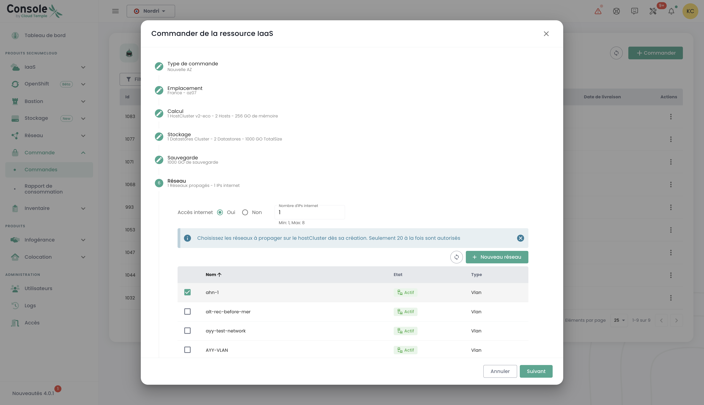
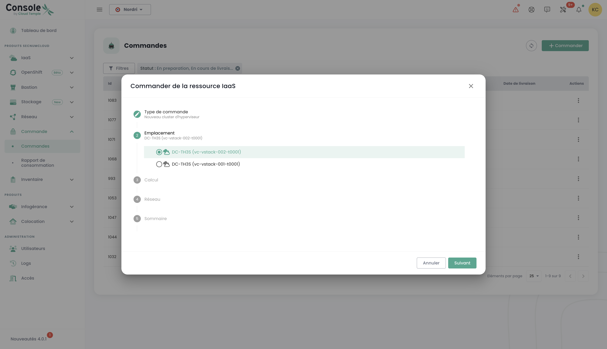

## Concept

The tracking of new resource deployment is done in the __'Orders'__ menu, accessible in the green banner on the left side of the screen.

It allows you to view the ordered Cloud resources, those currently being deployed, and any errors within a [tenant](tenants.md) of your [Organization](organisations.md).

*__Note: At this moment, a global view at the organization level of all resources deployed in different tenants is not yet possible.__ This issue will be addressed in 2024 by implementing a portal dedicated to the sponsor (in the sense of the signatory) and the management of their organization.*

The deployment of resources or their removal is done in each of the products in the __'IaaS'__ and __'Network'__ menus on the left side of the screen in the green banner.
It is also possible to directly view deliveries at the level of the Cloud Temple console notifications:

From the orders page, you can see the progress of a delivery and possibly interact with the team by providing comments or clarifications:

**Note**: **It is not possible to launch multiple orders of the same resource type simultaneously. You will therefore have to wait for the current order to be processed and finalized before you can place a new one. This ensures efficient and orderly management of resources within your environment.**

## Ordering a new availability zone

It is possible to add a new availability zone by accessing the "**Order**" menu. This option allows you to expand your resources and improve the availability and resilience of your applications with just a few clicks:

We start by selecting the desired location, first choosing the geographical region, then the corresponding availability zone (AZ) from those available. This step allows you to tailor the deployment of your resources based on the location and requirements of your infrastructure:

Next, proceed with the selection of the desired hypervisor cluster type, choosing the one that best meets the performance and management needs of your cloud infrastructure:

Then select the number of hypervisors and the desired amount of memory, in order to adapt the resources to the workload and specific requirements of your cloud environment:

Next, select the number of datastores to provision in the cluster and their types. It's important to note that the maximum number of allowed datastores is 10, with a minimum of 2 datastores required. Each different type of datastore will result in the creation of an additional datastoreCluster. For example, if you choose 2 "live" type datastores and 1 "mass" type datastore, this will result in the formation of 2 distinct datastoreClusters:

Define the necessary storage size for backup, ensuring to plan for a capacity equivalent to that of your production storage. Take into account an average compression rate of 2 to optimize backup space and ensure effective protection of your data:

Select the networks to propagate based on your needs. You also have the option to enable the "Internet access" if necessary, by defining the number of desired IP addresses, with a choice between 1 and a maximum of 8:

You then get a summary of the selected options before validating your order.

## Order additional storage resources

The logic of block storage allocation on compute clusters is [described here](../iaas/storage.md).

### Deploy a new compute cluster

Proceed with the order of a hypervisor cluster by selecting the options suitable for your virtualization needs. Define key characteristics such as the number of hypervisors, the type of cluster, the amount of memory, as well as the required computing resources:

Select the availability zone:

Choose the type of compute blade:

You then have the option to select existing networks and propagate them, or to create new ones directly at this stage, depending on the needs of your infrastructure. Note that the total number of configurable networks is limited to a maximum of 20:

You then get a summary of the selected options before validating your order and you can then view your current order:

### Deploy a new storage cluster

In the "**order**" menu, proceed to order a **new storage cluster** for your environment by selecting the options that match your needs in terms of capacity, performance, and redundancy. Select the location:

Define the number of datastores to be provisioned in the cluster and their type, adhering to the following limits: a minimum of 2 datastores and a maximum of 10 can be configured. Choose the types of datastores that best meet your needs in terms of performance, capacity, and usage, to optimize the storage of your environment:

Select the desired storage type from the various options available:

You will then access a complete summary of the options you have selected, allowing you to verify all parameters before definitively validating your order:

### Deploying a new datastore within a VMware SDRS cluster

In this example, we will add block storage for a VMware infrastructure.
To add an additional datastore to your SDRS storage cluster, go to the __'Infrastructure'__ submenu, then __'VMWare'__. 
Then select the VMware stack and the availability zone. Next, go to the __'Storage'__ submenu.

Choose the SDRS cluster that matches the performance characteristics you want and click on the __'Add a datastore'__ button located in the table 
with the list of datastores. 

__note__ :  
- *The size of the smallest LUN that can be activated on a cluster is __500 GiB__.*  
- *The performance of a datastore ranges from an average of 500 iops/TiB to an average of 15000 iops/TiB. __This is a software throttling performed at the storage controller level__.*  
- *The compatibility of the disk volume consumed by your organization is the sum of all LUNs across all used AZs*.
- The __'order'__ and __'compute'__ permissions are required for the account to perform this action.

### Ordering new networks

The network technology used on the Cloud Temple infrastructure is based on [VPLS](https://fr.wikipedia.org/wiki/Virtual_Private_LAN_Service). It allows you to benefit from __level 2 networks continuously between your availability zones within a region__. 
It is also possible to share networks between your tenants and terminate them in the hosting zone.
Basically, you can imagine a Cloud Temple network as an 802.1q vlan available at any point of your tenant.

*The complete details of creating a new network are [described in the network section](../network/private_network.md).*
The ordering of a new network and the sharing decisions between your tenants are carried out in the __'Network'__ menu of the green banner on the left side of the screen. Networks will first be created, then a separate order will be generated to propagate them. You can track the progress of ongoing orders by accessing the "Order" tab in the menu, or by clicking on the information labels that redirect you to active or processing orders.

It is also possible to propagate existing networks or to separate the two steps, starting with the creation of the network, then proceeding with the propagation later according to your needs. The propagation option is found in the options of the selected network:

Click on the "Propagate" option for an existing network, then select the desired propagation target. This step allows you to define the location or resources on which the network should be propagated:

### Disabling a Network

A network can also be disabled if necessary. This option allows you to temporarily pause access to or use of the network without permanently deleting it, thus providing flexibility in managing your infrastructure according to your needs.

The disable option is found in the options of the selected network.

## Adding Additional Hypervisors to a Compute Cluster

The operational logic of compute clusters is [described here].

Adding hypervisors to a compute cluster is done in the __'IaaS'__ menu in the green banner on the left side of the screen.
In the following example, we will add computation to a hypervisor cluster using VMware technology.

Go to the sub-menu __'Infrastructure'__ then __'VMWare'__. Then choose the VMware stack, the availability zone, and the compute cluster.
In this example, it is the __'clu001-ucs12'__. Click on the __'Add a host'__ button located in the table with the list of hosts, at the top right.

__note__:

- *__The configuration of a cluster must be homogeneous__. Thus, it is not allowed to mix hypervisor types within a cluster. All blades must be of the same type.*
- *The __'order'__ and __'compute'__ rights are necessary for the account to carry out this action.*

## Adding additional memory resource to a compute cluster

The logic of memory allocation on compute clusters is [described here](../iaas/compute.md).
To add RAM to a cluster, simply go to the cluster configuration (as for adding a compute host as previously seen) and click on __'Modify Memory'__.

__note__ :  
- *__Machines are delivered with the full amount of physical memory__. Unlocking the memory resource is just a software activation at the cluster level.*  
- *It is not possible to modify the amount of physical memory of a blade type. Be sure to take into account the maximum capacity of a blade when creating a cluster.*  
- *The __'order'__ and __'compute'__ rights are necessary for the account to carry out this action.*