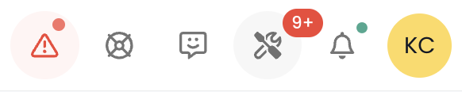
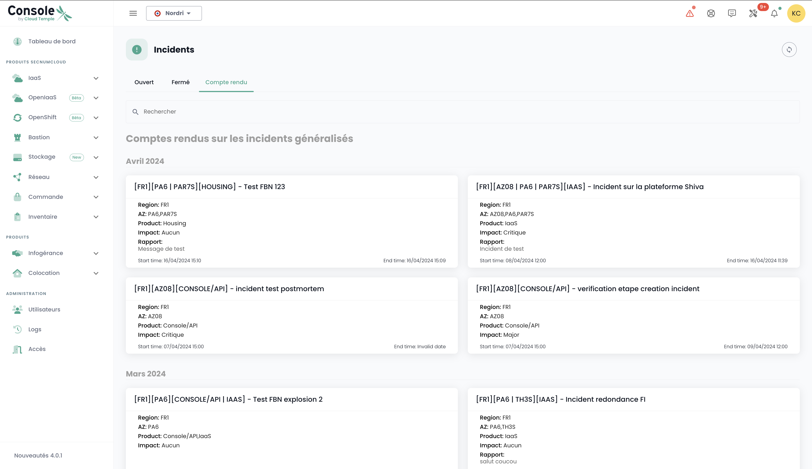

Like any Cloud infrastructure platform, the Cloud Temple platform is subject to regular hardware and software maintenance.

## Access to Ongoing Operations and Incidents

The operations tracking icon allows you to view planned operations on the Cloud Temple infrastructure as well as open incidents on the tenant. This icon is accessible in the icon bar at the top left of the screen and has the shape of a __'Tools'__ icon.

This icon aims to provide visibility on planned, ongoing, and completed interventions and/or incidents on the tenant.

When interventions and/or incidents are in progress, a number appears on the icon.
By clicking on quick view, you will find the ongoing interventions. It is also possible to click on __‘All interventions’__ or __‘All incidents and tenant reports’__ to display more details.

## Monitoring of scheduled interventions

The Interventions page is composed of two tabs. The first tab allows you to view the scheduled interventions for the next 30 days and the ongoing interventions.

Completed interventions are visible in the second tab ‘Completed’

Access to this information requires the user profile permission '**intervention_read**'.

## Incident management

Two types of incidents need to be distinguished: global incidents, which affect the entire system, and client-specific incidents, which impact only the resources or services associated with a particular client.

### Global Incidents

Retrieving information about global incidents does not require any special permissions. A red banner is displayed as soon as you log into the console to warn of an ongoing global incident. The user has the option to temporarily hide this banner during their session, but it will reappear with each new login or page refresh, as long as the incident remains unresolved.

A __'Learn More'__ button directs to the public incident tracking page, providing access to additional information about the ongoing incident:

It is possible to obtain global incident reports. Access to these reports requires the specific permission '**incident_management**'.

Here is an example of the tab displaying these reports:

### Incidents on a Sponsor Perimeter

Visibility of incidents specific to a client perimeter requires the **incident_read** permission. These incidents are represented by a dedicated icon, accompanied by a red badge indicating the number of ongoing incidents.

The icon is clickable, allowing you to list the tickets associated with the incidents. Each ticket includes a link to the incident details, providing the opportunity to monitor the progress of their resolution:

To view the details of an incident, you must be the author of the incident ticket or have the **support_management** permission.

### Notification Management
To quickly inform users in case of a new incident, an email notification system has been implemented. From their user profile, a tab titled '*My Subscriptions*' allows users to subscribe to notifications for both types of incidents. This way, they will receive an email shortly after an incident is reported or resolved.

The email subject will indicate the type of incident and, in the case of an incident related to a perimeter, the name of the impacted perimeter. The notification will also contain a link allowing direct access to the incident details:

