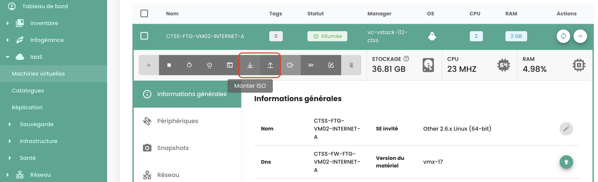
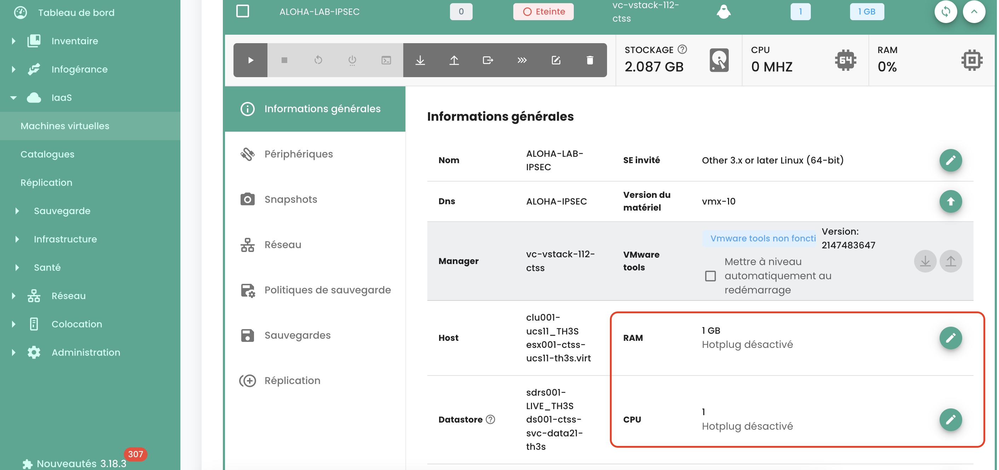
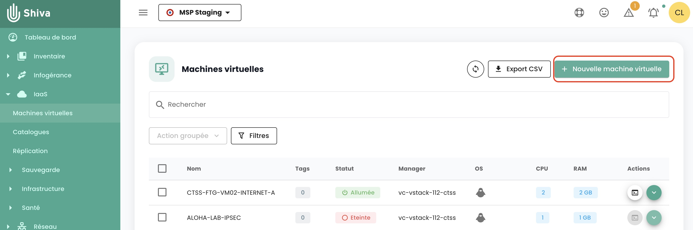
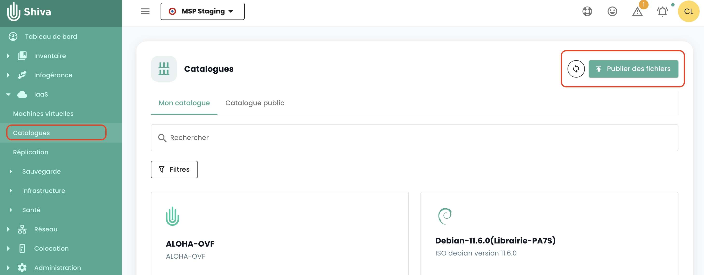
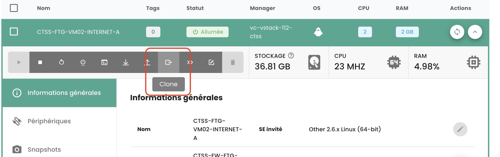
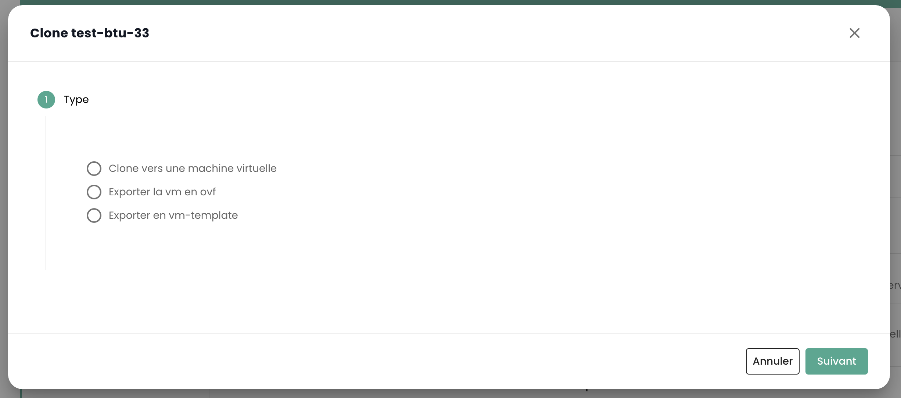

## Comment monter un ISO dans une machine virtuelle ?

Allez dans l'onglet __'Machines Virtuelles'__ sur menu __'IaaS'__, affichez les détails d'une machine virtuelle. Cliquez sur le bouton __'Monter ISO'__ :



Sélectionnez la bibliothèque de contenu où se trouve l'ISO à monter ou sélectionner un datastore et naviguer dans les dossiers pour retrouver l'ISO cible.


## Comment éditer la RAM ou le CPU d'une machine virtuelle ?
Allez dans l'onglet __'Machines Virtuelles'__, affichez les détails d'une machine virtuelle, 
sélectionnez l'onglet __'Infos générales'__ et cliquez sur le bouton d'édition de la variable à modifier :



## Comment créer une machine virtuelle ?
Allez sur la page __'Machines Virtuelles'__ et cliquez sur le bouton 'Nouvelle machine virtuelle'.



## Comment actualiser les détails d'une machine virtuelle ?

Si les détails de la machine n'ont pas encore été affichés depuis le dernier chargement de la page, cliquez sur la machine virtuelle. 
Dans le cas contraire, les détails de la machine doivent être affichés pour pouvoir cliquer sur le bouton dans la colonne action de la machine virtuelle sélectionnée.

## Pourquoi ma machine virtuelle se met à charger sans que j'effectue d'action ?

Ce comportement signifie qu'__une autre personne__ effectue des actions sur la même machine virtuelle.

## Pourquoi je ne peux pas ajouter de disques à ma machine virtuelle ?

Si le bouton pour ajouter un disque est désactivé, alors __le nombre maximum de disques__ est atteint.

## Pourquoi je ne peux pas modifier le disque de ma machine virtuelle ?

Un disque virtuel ne peut pas être modifié s'il est concerné par __un snapshot__ ou s'il est déjà __en cours de modification__.

## Pourquoi je ne peux pas supprimer un disque sur ma machine virtuelle ?

Pour supprimer un disque, la machine virtuelle doit être __éteinte__. Si la machine virtuelle est éteinte et 
que la suppression du disque échoue, vérifiez que le disque n'est pas sauvegardé dans __un snapshot__. 

## Quels sont les modes de disques ?

  - __Persistant__ : Les modifications sont immédiatement et définitivement écrites sur le disque virtuel. **C'est le mode recommandé.**
  - __Indépendant non-persistant__ : Les modifications apportées au disque virtuel sont consignées dans un nouveau log et supprimées à la mise hors tension. Non affecté par les snapshots. **Il n'est pas pris en charge par la sauvegarde.**
  - __Indépendant persistant__ : Les modifications sont immédiatement et définitivement écrites sur le disque virtuel. Non affecté par les snapshots. **Il n'est pas pris en charge par la sauvegarde.**

## Pourquoi je ne peux pas éditer CPU/RAM lorsque la machine virtuelle est allumée ?

La machine virtuelle n'a pas l'option nécessaire, qui est activée par défaut. Pour activer cette option, veuillez contacter le support.

## Comment publier des ISO ou OVF dans une bibliothèque de contenu ?

Pour publier un ISO/OVF, il faut aller dans la vue __'Catalogue'__ et cliquer sur le bouton __'publier des fichiers'__ en haut de la page :



## Comment est configuré le clavier de la console ?

Ce point est décrit [dans la section console du pilotage des machines virtuelles](../../../iaas/compute.md#console-dune-machine-virtuelle)

## Est-il possible d'avoir le caractère '@' via la console de Shiva ?

Ce point est décrit [dans la section console du pilotage des machines virtuelles](../../../iaas/compute.md#console-dune-machine-virtuelle)

## Comment transformer une VM en modèle ?

Sélectionnez une machine virtuelle et utilisez le bouton d'action __'clone'__ :



Sélectionnez __'Exporter en vm-template'__ :



Renseignez ensuite les informations nécessaires. Il sera alors possible de déployer une nouvelle VM à partir du modèle depuis le bouton __'Nouvelle machine virtuelle'__ ou depuis la page __'Catalogues'__. Il est aussi possible d'exporter la VM au format OVF.

## Comment cloner une machine virtuelle ?

Voir la réponse dans la section sauvegarde : [cloner une machine virtuelle](../backup/backup.md)

## À quoi correspond le pourcentage réservé de la mémoire sur un host cluster ?
Ce pourcentage correspond à une limite imposée au groupe de ressources correspondant au cluster. 
Sur l'exemple suivant, la partie grise correspond à la mémoire réservée et la partie verte à la mémoire utilisée :


## Pourquoi le stockage de ma machine virtuelle ne correspond pas à la taille de ses disques ?

Le stockage indiqué sur une machine virtuelle ne correspond pas uniquement à la taille des disques, 
cette valeur inclut également __les logs, les snapshots, les fichiers de configuration, etc__.

## Comment convertir un fichier OVA vers OVF et inversement ?
La méthode la plus courante utilisée est Vmware convertor mais il existe aussi une méthode simple en utilisant ```tar```

### Extraction du fichier ova
```
$ tar -xvf vmName.ova
```

### Créer un fichier OVA depuis un fichier OVF
```
$ tar -cvf vmName-NEW.ova vmName.ovf vmName-disk1.vmdk vmName.mf

```