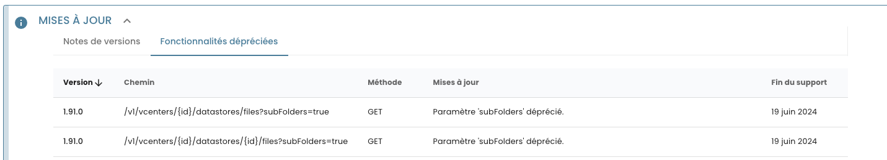

----------

## mars 2024 - Know Issue 1 : Lenteur de l'API Shiva sur IaaS VMWARE - GET /datastores/

Nous souhaitons partager des informations importantes concernant un problème identifié au sein de la Console Cloud Temple (Shiva), spécifiquement lié à l'utilisation de deux endpoints API : **'GET /datastores/id/files'** et **'GET /datastores/files'**. 

Ces endpoints, essentiels pour naviguer dans les datastores, ont révélé des limitations significatives lorsqu'ils sont employés avec l'argument `subFolders=true`, une fonction censée faciliter l'accès récursif aux dossiers et fichiers.

### Contexte du Problème

Lorsqu'activé, l'argument `subFolders=true` devrait permettre aux utilisateurs de récupérer efficacement les informations des sous-dossiers contenus dans un datastore spécifique. Cependant, des problèmes de performance, incluant des délais d'exécution longs jusqu'à des timeouts, ont été observés.

###  Analyse

Après une enquête approfondie, il a été déterminé que ce problème est intrinsèquement lié à la manière dont ces endpoints traitent les demandes, particulièrement dans le contexte de datastores de grande taille. Cette situation est reconnue comme un bug connu au sein de la plateforme VMware, indépendant de notre volonté.

#### Solution de Contournement

Nous proposons une méthode alternative pour naviguer dans les structures de fichiers des datastores. Cette solution temporaire consiste à répliquer le comportement de navigation des fichiers côté client. Elle implique d'effectuer l'appel initial sans `subFolders=true` et de spécifier directement les chemins d'accès, ajoutant des temps d'attente programmés entre les appels API pour limiter la charge sur l'API et prévenir d'éventuels problèmes de performance.

#### Méthode Suggérée

1. **Initialisation :** Commencez par une requête à l'endpoint sans `subFolders=true` pour récupérer une liste initiale de fichiers et dossiers.
   
2. **Traitement récursif :** Pour chaque élément :
   
      - Si c'est un fichier, ajoutez-le à une liste de résultats.
   
      - Si c'est un dossier, effectuez un appel récursif en utilisant le chemin de ce dossier pour explorer son contenu.
  
3. **Intégration des temps d'attente :** Insérez des pauses entre les appels pour réduire la charge.
   
4. **Aggrégation :** Compilez les résultats dans une liste globale.

### Avenir de ces Endpoints

Nous avons déprécié ces endpoints en version 1.91 de l'API car aucune solution pérenne n'a été trouvée :

