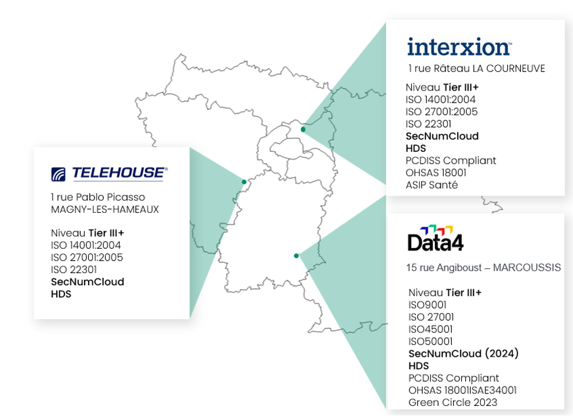
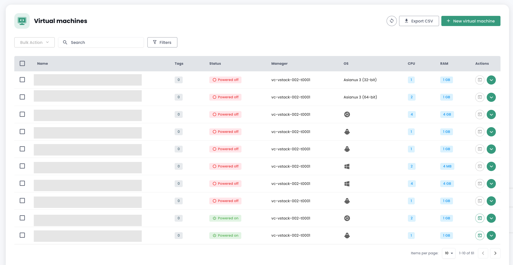

## Régions

L'infrastructure Cloud Temple est prévue pour permettre la continuité d'activité de vos applications et de vos plateformes. 
Au sein d'une région, vous bénéficiez d'une continuité réseau de niveau 2.

Ainsi, il est possible de définir une architecture technique sur la région Paris, utilisant 3 sites physiques pour permettre la mise en place d'une plateforme en haute disponibilité avec quorum.

En janvier 2024, la plateforme IaaS Cloud Temple dispose des régions suivantes :

- Région FR1 (Paris)

### Région FR1

La région FR1 est basée sur trois sites physiques en région parisienne. 

Chaque site est à plus de 30km à vol d'oiseau des autres. En moyenne, il faut compter 80Km de distance optique entre chaque site. La latence garantie entre les sites est inférieure à 4 ms.

### Extensions régionales

L'ouverture de nouvelles régions est principalement associée aux opportunités marchés. En janvier 2024, l'ouverture d'une région en europe du Sud et d'une région en europe du Nord sont à l'étude.

## Zones de disponibilité 

Chaque site physique au sein d'une région dispose d'une ou plusieurs salles privatives pour nos infrastructures. Ces salles sont à l'usage exclusif de Cloud Temple.

__Chaque salle physique correspond à une zone de disponibilité (AZ / Availability Zone)__ et est totalement autonome d'un point de vue électricité, cooling, calcul, stockage et réseau.
Le choix d'une zone de disponibilité implique donc le choix d'un site physique et d'une région.

Lors du déploiement initial de votre [organisation](../console/organisations.md),
vous choisissez le nombre de zones de disponibilité que vous souhaitez (entre 1 et 3) pour chacun de vos [tenants](../console/tenants.md).

La console Shiva vous propose automatiquement des zones de disponibilités sur des sites physiques distincts de manière à répartir votre infrastructure sur le maximum de site physique.

*__Nota : Si vous souhaitez un paramétrage spécifique pour un contexte particulier (plusieurs AZ sur le même site physique), il est nécessaire de faire une demande de support.__*

| Référence de commande                                        | Unité           | SKU                       |  
|--------------------------------------------------------------|-----------------|---------------------------|
| TENANT - *(REGION)* - Activation d'une zone de disponibilité | 1 AZ par tenant | csp:*(REGION)*:iaas:az:v1 |

## Machines virtuelles
Une machine virtuelle est un environnement virtualisé qui fonctionne sur une machine physique. 
Elle possède son propre système d’exploitation (OS) et bénéficie des mêmes caractéristiques qu’une machine physique : CPU, mémoire RAM, disque dur et carte réseau, GPU, Bios, ...
Dans le cadre de l'offre IaaS, elle est hébergée sur des ressources de calcul et de stockage dédiés. 
Vous avez la possibilité de créer des machines virtuelles "from scratch" ou bien de les déployer à partir de `Templates` disponibles dans un catalogue public fourni par Cloud Temple. 

