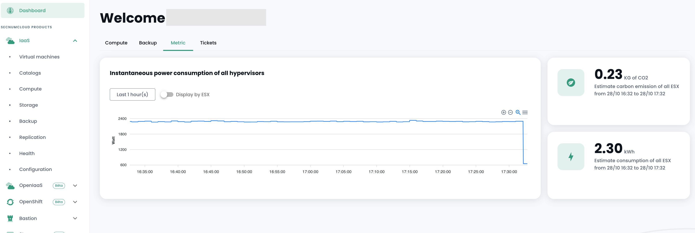
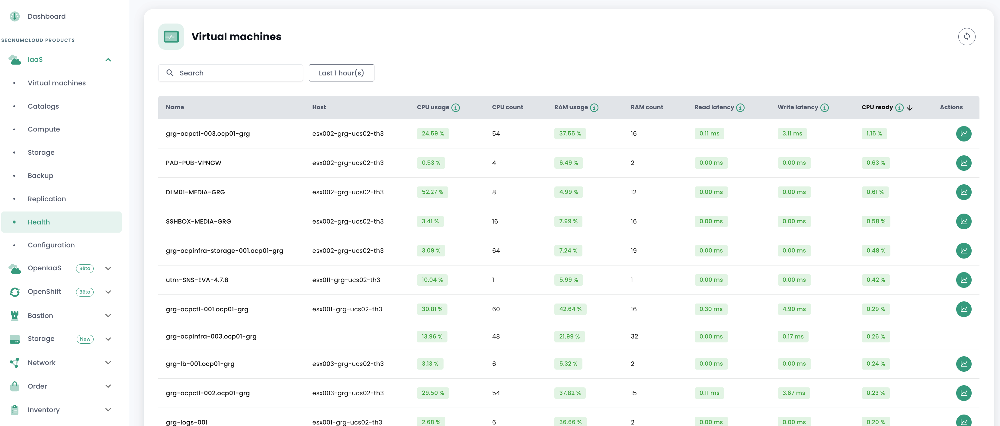
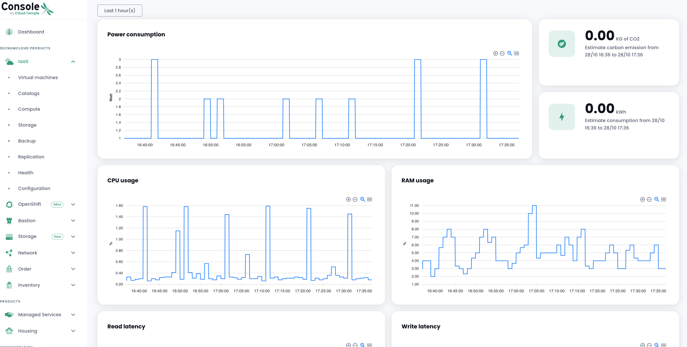

La métrologie sur l'infrastructure __'IaaS'__ permet de visualiser les graphiques de performance ainsi que la consommation électrique.

Les concepts associés à [la métrologie dans la console Cloud Temple sont décrit ici](../console/metrics.md).

Les données sont disponibles depuis le tableau de bord et depuis un nouveau menu appelé Santé.



Un menu permettant de visualiser l’état de santé des machines virtuelles via les données de performance.



Visualisez en détail les données de performances



Bien que nous mettions à disposition des tableaux de bord permettant de visualiser les metrics de performances
de nos produits, nous mettons également à disposition un proxy pour que vous puissiez visualiser dans vos outils.
Si vous souhaitez utiliser votre propre Grafana, vous pouvez le faire en suivant ce tutoriel.
[Configurer une datasource Grafana](../console/howto.md#etape-7--configurer-la-console-shiva-en-tant-que-datasource-dans-grafana)

__*Remarque :*__

``` La permission metrics_read est necessaire pour avoir aux metrics```

``` Veuillez noter qu'il est important d'avoir vos ESX en dernière version, sinon les métriques de consommation peuvent être incorrectes.```
