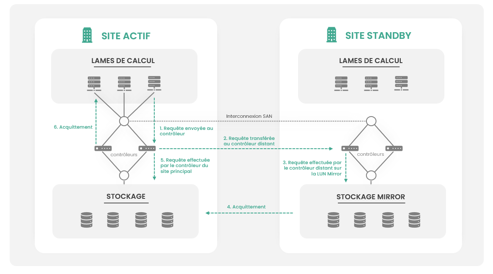
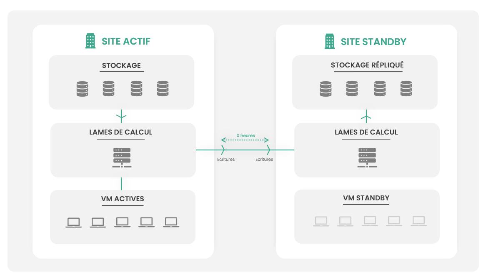

## Généralité sur le stockage 

Cloud Temple propose plusieurs classes de stockage basées sur la technologie [IBM FlashSystem](https://www.ibm.com/flashsystem/) 
et [IBM SVC](https://www.ibm.com/products/san-volume-controller).

La technologie __IBM SVC__ permet de délivrer le niveau de performance requis pour les environnements de nos clients grâce à la grande
quantité de cache mémoire embarquée dans les contrôleurs et à la possibilité de répartir l’ensemble des IOPS
d’un serveur sur plusieurs SAN.

Elle est aussi utilisée pour permettre la réplication de vos LUNs de stockage en mode bloc entre
les zones de disponibilité ou faciliter les interventions sur les baies de stockages.

## Stockage en mode bloc

### Généralité

Le stockage est principalement du stockage de type FLASH NVME dédié aux charges de travail professionnelles.
Les disques sont utilisés par les baies de stockage en [__'Distributed Raid 6'__](https://www.ibm.com/docs/en/flashsystem-5x00/8.6.x?topic=configurations-distributed-raid-array-properties).

Le classe de stockage __'Mass Storage'__ propose des disques mécaniques pour les besoins d'archivages
dans un contexte d'efficience économique. Plusieurs niveaux de performances sont disponibles :

| Référence                         | Unité | SKU                                          | 
|-----------------------------------|-------|----------------------------------------------|
| FLASH - Essentiel - 500 IOPS/To   | 1 Gio | csp:(region):iaas:storage:bloc:live:v1       |
| FLASH - Standard - 1500 IOPS/To   | 1 Gio | csp:(region):iaas:storage:bloc:medium:v1     | 
| FLASH - Premium - 3000 IOPS/To    | 1 Gio | csp:(region):iaas:storage:bloc:premium:v1    |
| FLASH - Enterprise - 7500 IOPS/To | 1 Gio | csp:(region):iaas:storage:bloc:enterprise:v1 |
| FLASH - Ultra - 15000 IOPS/To     | 1 Gio | csp:(region):iaas:storage:bloc:ultra:v1      | 
| MASS STORAGE - Archivage          | 1 Tio | csp:(region):iaas:storage:bloc:mass:v1       |

*__Nota__ :*

- *La disponibilité du stockage est de 99.99% mesuré mensuellement, plage de maintenance incluse,*
- *Il n'y a pas de restriction ou de quota sur la lecture ou l'écriture,*
- *Il n'y a pas de facturation à l'IOPS,*
- *Il n'y a pas d'engagement de performance sur la classe __'Mass Storage'__,*
- *La taille minimale d'une LUN de stockage est de 500Gio,*
- *Lors de l'usage d'un mécanisme de réplication de stockage, les performances doivent être identiques sur les deux zones de disponibilité,*
- *Aucun mécanisme d'optimisation "intelligent" de type compression ou déduplication n'est mis en œuvre : quand vous réservez 10Tio de stockage, vous avez physiquement 10Tio utile de stockage mis en œuvre sur les machines IBM.*
- *Les LUNs de stockage sont dédiés à l'environnement client.*

### Utilisation dans le cadre de l'offre de calcul vmware

Dans le cadre de l'utilisation du stockage en mode bloc sous forme de datastore dans l'offre de calcul VMware de Cloud Temple, **vous devez prendre en compte plusieurs considérations importantes** :

1. **Fichier de swap (.VSWP) lors du démarrage des machines virtuelles** : Lorsqu'une machine virtuelle démarre, elle crée un fichier .VSWP de la taille de sa mémoire sur le disque. Par conséquent, pour pouvoir démarrer vos machines virtuelles, vous devez toujours disposer dans votre datastore d'un espace libre équivalent à la somme des tailles mémoires de vos machines virtuelles. Par exemple, si votre datastore dispose de 1 Tio de stockage bloc et que vous souhaitez démarrer 10 machines virtuelles de 64 Gio de mémoire chacune, 640 Gio d'espace disque seront nécessaires. Sans cet espace, le démarrage des machines sera limité par la capacité disponible pour créer les fichiers de swap.

2. **Espace libre pour les snapshots de sauvegarde** : Le service de sauvegarde utilise des clichés instantanés (snapshots). Vous devez donc toujours avoir suffisamment d'espace libre pour permettre la création d'un instantané lors de la sauvegarde d'une machine virtuelle. La taille de l'instantané dépend du volume d'écriture de la machine virtuelle et du temps nécessaire pour effectuer la sauvegarde. En règle générale, il est recommandé de maintenir au moins 10 % d'espace libre pour cette opération.

3. **Gestion des disques dynamiques** : Soyez prudent avec l'utilisation des disques dynamiques. Si vous ne maîtrisez pas leur croissance, un manque d'espace physique peut entraîner un gel (freeze) de la machine virtuelle dans le meilleur des cas, ou un plantage avec corruption dans le pire des cas. Il est crucial de surveiller attentivement l'espace disponible sur vos datastores lorsque vous utilisez ce type de disque.

Une gestion proactive de l'espace disque est essentielle pour assurer le bon fonctionnement de vos machines virtuelles et la fiabilité des sauvegardes. Assurez-vous de toujours disposer de l'espace nécessaire pour les fichiers de swap, les snapshots et la croissance des disques dynamiques.

## Stockage en mode backup

Le stockage dédié à la sauvegarde de vos machines virtuelles est auto-provisionné par la plateforme [IBM Spectrum Protect Plus](backup.md) dans la limite du quota commandé. 

| Référence                | Unité | SKU                                      | 
|--------------------------|-------|------------------------------------------|
| MASS STORAGE - Archivage | 1 Tio | csp:(region):iaas:storage:bloc:backup:v1 |

## Stockage objet

Le stockage objet Cloud Temple est basé sur la technologie [DELL ECS](https://www.dell.com/en-us/dt/storage/ecs/).

Vous trouverez la description de ce stockage dans la section PaaS : [stockage objet].

## Réplication du stockage en mode bloc

### Principes

Pour permettre la mise œuvre de vos plans de reprise d'activité, lorsqu'il n'est pas possible d'être en 
situation de continuité d'activité avec des mécanismes applicatifs et que la réplication des machines virtuelles 
n'est pas adaptée, Cloud Temple propose des __mécanismes de réplication du stockage en mode bloc entre les zones de disponibilité d'une région__.

Ces mécanismes de réplication sont appliqués sur les LUNs de stockage de vos environnements, en complément des sauvegardes. 
Le choix de l'utilisation d'un mécanisme de réplication sur un environnement __dépend de nombreux facteurs dont sa criticité, la perte de données tolérée ou encore la performance visée__ pour l'application. 

Cloud Temple propose deux types de mécanismes déployés dans une configuration actif/passif : 

- La réplication __asynchrone__ (ou __'Global Mirror'__) : *La fonction __'Global Mirror'__ fournit un processus de copie asynchrone. 
Lorsqu'un hôte écrit sur le volume primaire, la confirmation de l'achèvement de l'E/S est reçue avant que l'opération 
d'écriture ne se termine pour la copie sur le volume secondaire. Si une opération de basculement est initiée, l'application 
doit récupérer et appliquer toutes les mises à jour qui n'ont pas été confirmées sur le volume secondaire. 
Si les opérations d'E/S sur le volume primaire sont mises en pause pendant une courte période, 
le volume secondaire peut devenir une correspondance exacte du volume primaire. Cette fonction est comparable à un processus 
de sauvegarde continue dans lequel les dernières mises à jour sont toujours manquantes. 
Lorsque vous utilisez Global Mirror à des fins de reprise après sinistre, vous devez réfléchir à la manière dont vous souhaitez gérer ces mises à jour manquantes.*

- La réplication __synchrone__ (ou __'Metro Mirror'__) : *La fonction __'Metro Mirror'__ est un type de copie à distance qui crée une copie synchrone 
des données d'un volume primaire vers un volume secondaire. Avec des copies synchrones, les applications hôtes écrivent sur le volume primaire, mais ne reçoivent pas de confirmation 
que l'opération d'écriture est terminée tant que les données ne sont pas écrites sur le volume secondaire. Cela garantit que les deux volumes contiennent des données identiques lorsque 
l'opération de copie est terminée. Après que l'opération de copie initiale est terminée, la fonction Metro Mirror 
maintient en permanence une copie entièrement synchronisée des données source sur le site cible. __Depuis le 1° janvier 2024, la fonction 'Metro Mirror' n'est plus commercialisée.__*

On définit alors un site dit "actif" ou "principal" et un site "passif" ou "standby".
Le plan de reprise d'activité est activé en cas de sinistre ou dans le cadre d'une demande de test du PRA. 
Le site passif prend ensuite le relais du site actif.

### Réplication asynchrone 

Lorsque vos charges de travail nécessitent des temps de reprise d'activité courts et qu'il n'est pas acceptable 
ou adapté d'utiliser des mécanismes de type réplications applicatives / réplication de machines virtuelles, 
il est possible de répliquer une LUN de stockage SAN entre deux zones de disponibilité d'une même région. 

Cette offre permet d'obtenir un __RPO de 15Mn__ et un __RTO inférieur à 4H__. Elle permet de repartir beaucoup plus rapidement que 
la mise en œuvre d'une restauration de sauvegarde.

Dans un volume de stockage en réplication asynchrone (__Global Mirror__), les contrôleurs de virtualisation SAN des 
deux zones de disponibilité travaillent de concert pour réaliser les opérations d'écritures sur les deux sites. 
Le site maitre n'attend pas l'acquittement d'écriture du site esclave.

Les étapes d'une opération d'écriture sont les suivantes :

1. Un hyperviseur souhaite réaliser __une opération d’écriture sur un volume Global-Mirror__ : il envoie sa requête au contrôleur SAN de sa zone de disponibilité, 
2. Le contrôleur SAN local demande au contrôleur SAN de la zone distante de réaliser l’opération d’écriture,
3. le contrôleur SAN local n'attend pas l'acquittement du SAN distant et réalise alors l’écriture localement,
4. Il donne __acquittement__ à l’hyperviseur ayant émis la requête,
5. __Les hyperviseurs du site distant n’accèdent pas directement à la LUN Global Mirror__ : Une demande de service est nécessaire.

| SLA       | Description                                                                                                                                       |   
|-----------|---------------------------------------------------------------------------------------------------------------------------------------------------|
| RPO 15mn  | En cas de sinistre sur le datacenter principal, la quantité de données maximales perdue correspond au maximum aux 15 dernières minutes d'écriture |
| RTO < 4H  | En cas de sinistre sur le datacenter principal, la reprise d'activité est garantie sous 4 heures selon la complexité des environnements.          |

En cas d’activation du PRA, l’équipe de Cloud Temple réalise une opération de présentation de la LUN __'Global Mirror'__ aux hyperviseurs distants pour qu’ils puissent accéder à la donnée. La mise en place de cette solution nécessite donc d'avoir réservé sur le site 'standby' de la ressource de calcul et de la RAM pour reprendre l'activité en cas de sinistre.

L'usage de cette technologie nécessite également le doublement de l'espace disque : il est nécessaire d'avoir exactement le même espace sur le site distant que sur le site local. 

L'usage de ce mécanisme peut impacter la performance de l'application à hauteur de 10 %. __Seules les classes de stockage 500 Iops/To, 1500 Iops/To et 3000 Iops/TO sont compatibles.__

| Référence                          | Unité  | SKU                                               |  
|------------------------------------|--------|---------------------------------------------------|
| STOCKAGE - Global Replication SAN  | 1 Tio  | csp:(region):iaas:storage:licence:globalmirror:v1 |

*__Nota__* : 

- *L'offre étant asynchrone, il est possible lors d'un sinistre que certaines opérations disques n'est pas été écrite sur le site distant. Il peut donc y avoir un risque sur la cohérence des données, a mitigé dans l'analyse de risque du plan de reprise d'activité.*
- *La réplication du stockage en mode bloc se fait de façon masquée pour les machines virtuelles et les applications,*
- *À ce titre, il est important de privilégier les scénarios de réplication applicative ou éventuellement de réplication de machine virtuelle,*
- *Le calcul et la mémoire, sur le site de reprise, peuvent être diminués pour optimiser les coûts si une situation dégradée est acceptable pour le métier lors de l'action du plan de reprise d'activité.*

### Réplication synchrone

__Depuis 1° janvier 2024, le mécanisme de réplication synchrone n'est plus commercialisé__

Dans le cas d'applications à très fortes criticités, ne tolérant aucune perte de données, il est conseillé d'adopter 
un système de réplication synchrone (ou metro-réplication) SAN entre les deux zones de disponibilité. 
Ce plan permet d'obtenir un RPO nul (de type 'dernière écriture disque').

Dans un volume de stockage en metro-réplication, les contrôleurs de virtualisation SAN travaillent de concert pour réaliser les opérations d'écriture sur les deux sites en simultanée. 

Les étapes d'une opération d'écriture sont les suivantes :

1.	Un hyperviseur souhaite réaliser une opération d’écriture sur un volume Metro-Mirror : il envoie sa requête au contrôleur SAN de son site.
2.	Le contrôleur SAN local demande au contrôleur SAN du site distant de réaliser l’opération d’écriture.
3.	Lorsque l’écriture est réalisée, le contrôleur SAN distant donne acquittement.
4.	Le contrôleur SAN local réalise alors l’écriture localement et donne acquittement à l’hyperviseur ayant émis la requête.
5.	Les hyperviseurs du site distant n’accèdent pas directement à la LUN Metro Mirror.

| SLA                            | Description                                                                                                                                                   |   
|--------------------------------|---------------------------------------------------------------------------------------------------------------------------------------------------------------|
| RPO = dernière écriture disque | En cas de sinistre sur le datacenter principal, la quantité de données maximales perdue est celle de la dernière écriture disque, soit un RPO proche de zéro. |
| RTO < 4H                       | En cas de sinistre sur le datacenter principal, la reprise d'activité est garantie sous 4 heures selon la complexité des environnements.                      |

En cas d’activation du PRA, l’équipe de Cloud Temple réalise une opération de présentation de la LUN métro-mirror aux hyperviseurs distants pour qu’ils puissent accéder à la donnée. 

La mise en place de cette solution nécessite donc d'avoir réservé sur le site standby de la ressource de calcul et de la RAM pour reprendre l'activité en cas de sinistre. 
L'usage de cette technologie nécessite également le doublement de l'espace disque : il est nécessaire d'avoir le même espace sur le site distant que sur le site local. 

À noter que l'usage de ce mécanisme peut impacter la performance de l'application à hauteur de 30 %. __Seule la classe de stockage 500 Iops/To est supportée__.

| Référence                                           | Unité  | SKU                                              |  
|-----------------------------------------------------|--------|--------------------------------------------------|
| STOCKAGE - Metro Replication SAN inter-datacenter   | 1 Tio  | csp:(region):iaas:storage:licence:metromirror:v1 |

*__Nota__* : 

- *La réplication du stockage en mode bloc se fait de façon masquée pour les machines virtuelles et les applications,*
- *À ce titre, il est important de privilégier les scénarios de réplication applicative ou éventuellement de réplication de machine virtuelle,*
- *Le calcul et la mémoire sur le site de reprise peuvent être diminué pour optimiser les couts 
si une situation dégradée est acceptable pour le métier lors de l'action du plan de reprise d'activité.*

## Réplication asynchrone de vos machines virtuelles en environnement VMware

La réplication asynchrone de vos machines virtuelles est un mécanisme qui consiste à pousser au niveau de l'hyperviseur source les opérations d'écriture sur le site standby à intervalle de temps régulier. 

Après une copie initiale à chaud de l'ensemble du stockage actif sur le site standby, seules les écritures sont poussées à intervalles réguliers sur le site en sommeil. 
Cet intervalle dépend du volume d'écriture (de toutes les heures à toutes les 24 heures).

La réplication des machines virtuelles s'appuie sur le mécanisme de clichés instantanés de l'hyperviseur. À ce titre, 
cette solution a les mêmes inconvénients, en particulier la sensibilité au volume d'écritures de la machine virtuelle, 
le processus de cliché instantané étant un mécanisme récursif pour la clôture du cliché instantané.

L'exemple typique de machine qui ne supporte pas le mécanisme de réplication des machines virtuelles est un 
serveur FTP qui reçoit les flux temps réels de caméras de surveillance. __La machine passe son temps à écrire et ne sera 
pas capable de clôturer un cliché instantané sans mise en pause du système d'exploitation pendant une période de temps significative
(plusieurs dizaines de minutes)__. Si l'hyperviseur n'arrive pas à clôturer le cliché instantané, c'est exactement ce qu'il fera,
sans possibilité d'intervenir sauf à corrompre la machine virtuelle.

| SLA             | Description                                                                                                                                               |   
|-----------------|-----------------------------------------------------------------------------------------------------------------------------------------------------------|
| RPO de 1H à 24H | En cas de sinistre sur le datacenter principal, la quantité de données maximale perdue est celle de la dernière poussée des écriture sur le site standby. |
| RTO  < 15mn     | Opération de démarrage de la machine virtuelle stoppée sur le site distant                                                                                |

En cas de besoin, ou en cas de défaut sur une machine du site principal, la machine miroir sur le site standby est activée. 
La reprise d'activité nécessite d'avoir réservé sur le site standby du calcul et de la RAM en standby. Il 
est nécessaire d'avoir le même espace de stockage sur le site passif que sur le site actif.

| Référence                         | Unité | SKU                                             |  
|-----------------------------------|-------|-------------------------------------------------|
| PRA - Replication VMware inter-AZ | 1 vm  | csp:(region):iaas:vmware:licence:replication:v1 |

*__Nota__ : Le calcul du RPO minimum doit être défini en fonction du taux de changement sur la machine virtuelle.*
