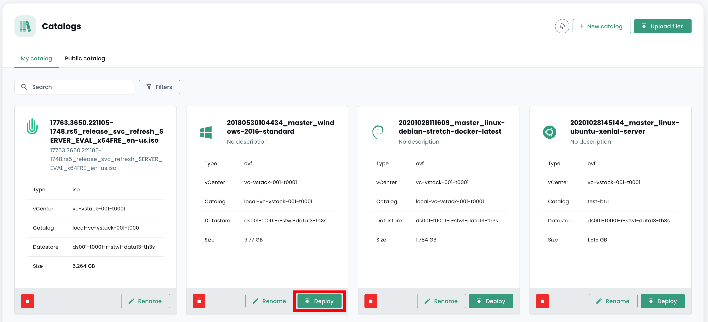
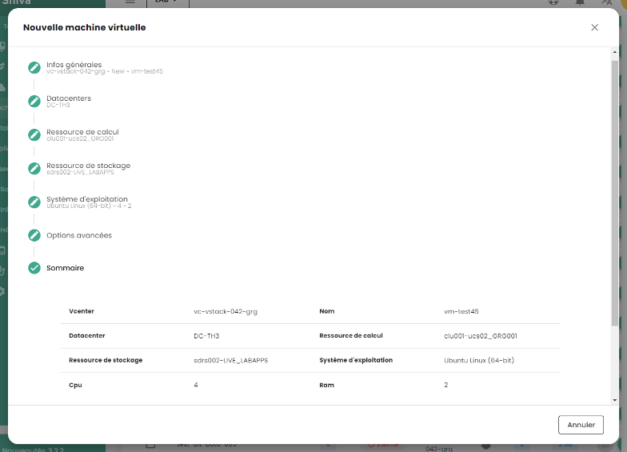
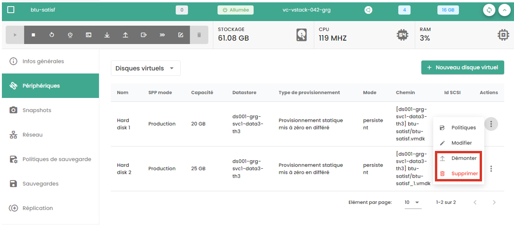
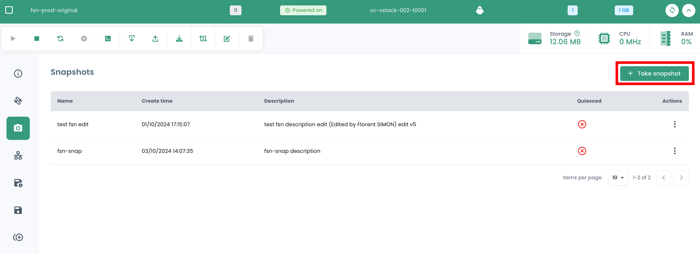
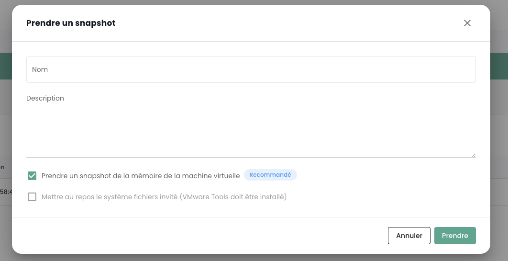
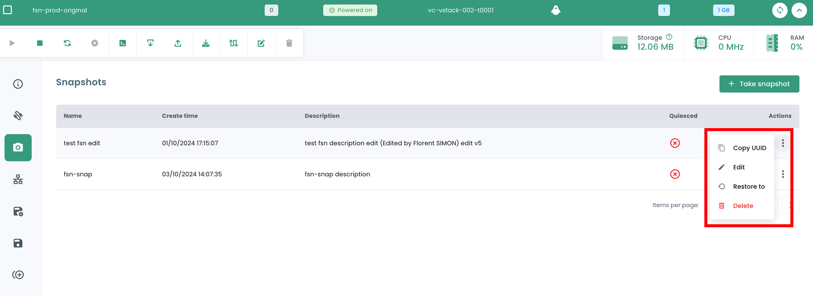
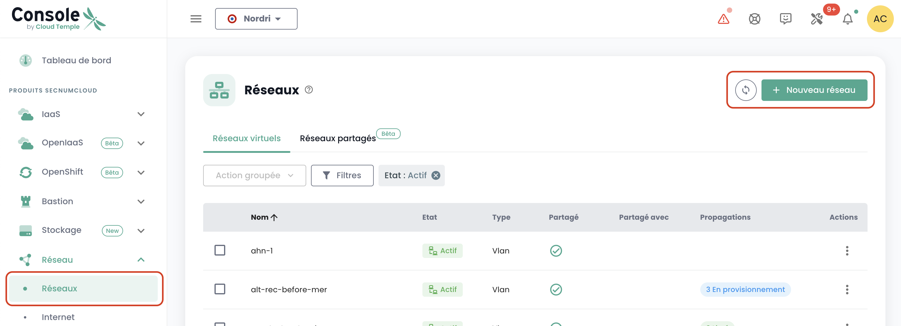
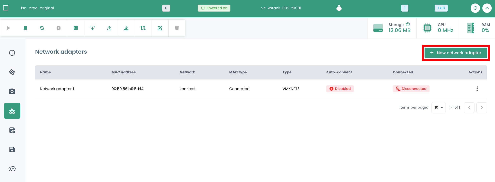

Dans ces guides, vous allez apprendre à piloter vos ressources IaaS du Cloud de Confiance.

## Déployer une machine virtuelle depuis un Template
Ce guide vous montre étape par étape comment déployer une machine virtuelle depuis un Template dans la console Shiva. 

Sur le portail Shiva, rendez-vous dans l'onglet __'IaaS'__, puis __'Catalogues'__. Avant de pouvoir déployer un Template, celui-ci doit être chargé dans votre catalogue privé, dans l'onglet __'Mon catalogue'__. 

Pour cela, vous avez deux possibilités : 

- *importer votre propre Template directement dans votre catalogue privé,*
- *importer un modèle depuis le catalogue public de Cloud Temple.* 

### Importer un Template personnel dans le catalogue privé
Dans l'onglet __'Mon catalogue'__, cliquez sur __'Publier des fichiers'__.

Suivez ensuite les étapes de publication du template, en renseignant son nom et une description, et en choisissant son emplacement dans une librairie.

Le Template doit ensuite apparaître dans votre catalogue privé. 

### Importer un Template depuis le catalogue public
Dans l'onglet __'Catalogue public'__, cliquez sur le bouton __'Ajouter à mon catalogue'__ du Template de votre choix pour l'importer dans votre catalogue privé. Celui-ci doit ensuite apparaître dans votre catalogue privé.

### Déployer le Template

Une fois le Template importé dans votre catalogue privé, vous pouvez le déployer en cliquant sur __'Déployer'__. 

Suivez ensuite les différentes étapes de déploiement de la ressource, en sélectionnant son emplacement physique (datacenter, cluster de calcul, datastore) et autres paramètres de configuration optionnels. 

## Créer une machine virtuelle à partir de zéro
Dans la section __'IaaS'__ puis __'Machines virtuelles'__, cliquez sur le bouton __'Nouvelle machine virtuelle'__ et suivez les différentes étapes de création de la machine.

1. __Informations générales__ : 
    - Sélectionner l’option *'Créer une machine virtuelle'* ;
    - Sélectionner le vCenter ;
    - Nommer la machine virtuelle.

2. __Choisir l'emplacement de la machine virtuelle__ :
    - Le datacenter ;
    - Le cluster de calcul ;
    - Le datastore.

3. __Configuration de la machine virtuelle__ :
    - Système d'exploitation ;
    - vCPU ;
    - RAM.

4. __Options avancées__ :
    - Disques virtuels ;
    - Contrôleurs ;
    - Adaptateurs réseaux.

## Disques virtuels

### Créer un nouveau disque virtuel
Dans le menu d’une machine virtuelle, cliquez sur l’onglet __'Périphériques'__ pour accéder à la liste des disques virtuels et des contrôleurs de votre machine virtuelle. 
Dans la section __'Disques virtuels'__, cliquez sur __'Nouveau disque virtuel'__ pour ajouter un nouveau disque à votre machine, puis sélectionnez l'option __'Nouveau disque'__.

Lorsque vous créez un nouveau disque, vous devez suivre les étapes suivantes :

1. Choix de l'emplacement du disque (datastore).

2. Capacité du disque.

3. Type de provisionnement : 

    - **Statique mis en zéro différé** (c'est le mode recommandé),
    - **Statique immédiatement mis à zéro**,
    - **Dynamique** (*)

4. Mode :

    - **Persistant** (les modifications sont immédiatement et définitivement écrites sur le disque virtuel). **C'est le mode recommandé.**
    - **Indépendant non-persistant** (les modifications apportées au disque virtuel sont consignées dans un nouveau log et supprimées à la mise hors tension, et ne sont pas affectées par les snapshots). **Ce mode n'est pas pris en charge par la sauvegarde.**
    - **Indépendant persistant** (les modifications sont immédiatement et définitivement écrites sur le disque virtuel, et ne sont pas affectées par les snapshots). **Ce mode n'est pas pris en charge par la sauvegarde.**

5. Contrôleur automatique ou manuel (IDE 0, IDE1, SCSI controller 0).

(*) *Le mode dynamique facilite l'attribution progressive d'espace disque dans le datastore à mesure que la machine virtuelle utilise davantage d'espace. Cependant, **cette méthode peut entraîner le blocage de la machine virtuelle si l'espace requis n'est pas disponible dans le datastore, ce qui peut mener à la corruption de la machine**. Opter pour cette option exige donc une analyse précise et détaillée de vos environnements.*

### Ajouter un disque virtuel existant à une machine virtuelle
Dans le menu d’une machine virtuelle, cliquez sur l’onglet __'Périphériques'__, cliquez sur __'Nouveau disque virtuel'__ et sélectionnez l'option __'disque existant'__. 

### Modifier un disque virtuel
Dans le menu d'une machine virtuelle, cliquez sur l'onglet __'Périphériques'__ puis cliquez sur le disque virtuel que vous souhaitez modifier. Dans la fenêtre qui s'ouvre, vous pouvez modifier la capacité du disque et/ou son mode de provisionnement.

### Démonter ou supprimer un disque virtuel

Cliquez sur la barre d'actions du disque virtuel souhaité. Pour le supprimer, cliquez sur __'Supprimer'__, et pour le démonter, cliquez sur __'Démonter'__. 

Notez que __pour supprimer un disque d’une machine virtuelle, celle-ci doit être éteinte__.

## Snapshots

### Prendre un snapshot
Rendez-vous dans l'onglet __'Snapshots'__ d'une machine virtuelle. Cette section donne la liste des snapshots de cette machine virtuelle, indiquant à chaque fois leur date et l'activation ou non du quiescing. 

Pour prendre un nouveau snapshot, cliquez sur le bouton __'Nouveau snapshot'__.

Vous pouvez alors nommer votre snapshots et indiquer notamment si :

1. Vous souhaitez capturer la mémoire : Cela permet notamment de revenir à l'état complet de la machine avec les processus qui étaient en execution au moment du snapshot. **C'est l'option recommandée. **
2. Vous ne souhaitez pas capturer la mémoire : dans ce cas, la machine sera simplement redémarrée si un retour arrière est demande sur le snapshot. c'est l'option la plus rapide à executer.
3. Si vous souhaitez prévenir, via les vmware-tools, le système d'exploitation du déclenchement du snapshot pour lui permettre de vider les tampons d'écriture.

### Restaurer un snapshot

Pour restaurer un snapshot, cliquez sur la barre d'actions correspondant au snapshot que vous souhaitez restaurer. Puis, cliquez sur __'Restaurer à'__. 

Cette barre d'actions vous permet également de renommer le snapshot en cliquant sur __'Modifier'__, ou de le supprimer en cliquant sur __'Supprimer'__.

**ATTENTION :**

- *Cette action est **destructive**. Toutes les données depuis le snapshots sont perdues.*
- *Attention **aux disques indépendants**, ils ne doivent pas faire partie d'une grappe LVM par exemple, sous peine de geler la machine virtuelle.*

## Réseaux
Dans la section __'IaaS'__ du menu de la console Cloud Temple, rendez-vous dans la partie [__Réseaux__](../network/private_network.md#le-réseau-dans-loffre-de-virtualisation-vmware).

Vous y trouverez la liste de vos réseaux virtuels privés déployés dans vos tenants.

### Créer un vLAN
Pour créer un nouveau réseau virtuel privé, rendez-vous dans la partie [__Réseaux__](../network/private_network.md#le-réseau-dans-loffre-de-virtualisation-vmware).

### Connecter une machine virtuelle à un réseau
Rendez-vous dans l'onglet __'Réseaux'__ de votre machine virtuelle. Vous y trouverez la liste des adaptateurs réseaux de votre machine virtuelle. Cliquez sur le bouton __'Nouvel adaptateur réseau'__ et sélectionnez le réseau souhaité.

Vous devez ensuite sélectionner le type d'adaptateur ainsi que le choix de génération de l'adresse MAC (automatique ou manuel).

### Déconnecter ou supprimer un adaptateur réseau

Cliquez sur la barre d'actions du périphérique réseau que vous souhaitez déconnecter ou supprimer.
Cliquez sur __'Déconnecter'__ pour déconnecter l'adaptateur réseau. Si vous souhaitez supprimer l'adaptateur réseau, vous devez d'abord le déconnecter, puis vous pouvez le supprimer en cliquant sur __'Supprimer'__.

