## Objet de ce guide

Ce guide détaille les étapes essentielles pour déployer efficacement un pare-feu individuel ou un cluster de pare-feux dans un environnement SecNumCloud.

**Remarque :** *Les configurations présentées dans ce document servent de guide de référence et doivent être soigneusement adaptées aux spécificités techniques, aux exigences de sécurité et aux objectifs opérationnels propres à chaque environnement*

## Prérequis à ce guide

### Droits nécessaires

Le déploiement des appliances virtuelles nécessite un accès au tenant du client dans la console Cloud Temple avec les permissions spécifiques suivantes :

Si vous utilisez l'offre **OpenIaaS** : 

| Nom de la permission                          | Description de la permission                                                                                                   |
| --------------------------------------------- | ------------------------------------------------------------------------------------------------------------------------------ |
| compute_iaas_opensource_console_access        | Offre OpenIaaS -Ouverture de la console d'une machine virtuelle                                                                |
| compute_iaas_opensource_infrastructure_read   | Offre OpenIaaS -Consultation de données avancées des ressources VMware (règles affinité/anti-affinité, configuration drs, etc) |
| compute_iaas_opensource_infrastructure_write  | Offre OpenIaaS -Gestion avancée des ressources VMware                                                                          |
| compute_iaas_opensource_read                  | Offre OpenIaaS -Consultation des ressources de type Machines Virtuelles                                                        |
| compute_iaas_opensource_management            | Offre OpenIaaS -Gestion des ressources de type Machines Virtuelles                                                             |
| compute_iaas_opensource_virtual_machine_power | Offre OpenIaaS -Gestion de l'alimentation d'une machine virtuelle                                                              |
| activity_read                                 | Consultation des journaux logs et activités                                                                                    |

Si vous utilisez l'offre **Vmware** : 

| Nom de la permission                          | Description de la permission                                                                                                   |
| --------------------------------------------- | ------------------------------------------------------------------------------------------------------------------------------ |
| compute_iaas_vmware_console_access            | Offre Vmware - Ouverture de la console d'une machine virtuelle                                                                 |
| compute_iaas_vmware_infrastructure_read       | Offre Vmware - Consultation de données avancées des ressources VMware (règles affinité/anti-affinité, configuration drs, etc)  |
| compute_iaas_vmware_infrastructure_write      | Offre Vmware - Gestion avancée des ressources VMware                                                                           |
| compute_iaas_vmware_read                      | Offre Vmware - Consultation des ressources de type Machines Virtuelles                                                         |
| compute_iaas_vmware_management                | Offre Vmware - Gestion des ressources de type Machines Virtuelles                                                              |
| compute_iaas_vmware_virtual_machine_power     | Offre Vmware - Gestion de l'alimentation d'une machine virtuelle                                                               |
| activity_read                                 | Consultation des journaux logs et activités                                                                                    |
  
Si vous souhaitez utiliser __*Terraform*__, les permissions suivantes supplémentaires sont requises :

| Nom de la permission                          | Description de la permission                                                                                                   |
| --------------------------------------------- | ------------------------------------------------------------------------------------------------------------------------------ |
| tag_read                                      | Consultation des tags, excepté les tags RTMS                                                                                   |
| tag_write                                     | Gestion des tags, excepté les tags RTMS                                                                                        |
| iam_read                                      | Consultation des droits utilisateurs                                                                                           |
| iam_write                                     | Gestion des droits utilisateurs                                                                                                |

L'image OVA de l'appliance à déployer doit être disponible avant de commencer le processus. Vous trouverez les images Fortinet sur [le site du support](https://support.fortinet.com/welcome/). Il est nécessaire de bénéficier d'un compte de support Fortinet. 

Aller dans la **section Download** puis **Firmware Images** :


**Au 1° Juillet 2024, la version 7.2 est recommandée.**

L'image à récupérer est la FGT_VM64 au format OVF/ZIP :

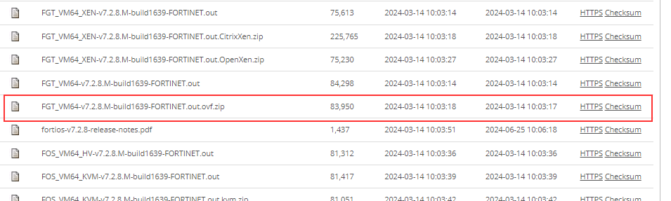

**Remarque :** *Si vous avez souscrit à une unité d'oeuvre firewall Fortinet, le support Cloud Temple peut mettre à disposition l'image au format OVA ainsi que la licence associée.*

| Unités d'œuvre d'infrastructure - FIREWALLS VIRTUELS | Unité             | sku                     |
| :--------------------------------------------------- | :---------------- | :---------------------- |
| FIREWALL UTM -Fortigate Virtuel VM02V - sans vdom    | 1	cluster virtuel | csp:fr1:licence:fw:ftg2 |
| FIREWALL UTM -Fortigate Virtuel VM04V - sans vdom    | 1	cluster virtuel | csp:fr1:licence:fw:ftg4 |
| FIREWALL UTM -Fortigate Virtuel VM08V - sans vdom    | 1	cluster virtuel | csp:fr1:licence:fw:ftg8 |
| FIREWALL UTM -Fortigate - 5 vdom complémentaires     | 5	vdom            | csp:fr1:licence:fw:vdom |

### Informations de connectivité réseau

Vous devez disposer des informations nécessaires pour établir la session BGP avec le backbone. Ces données sont disponibles dans la console Cloud Temple, dans la section Network → Internet → ASNs :

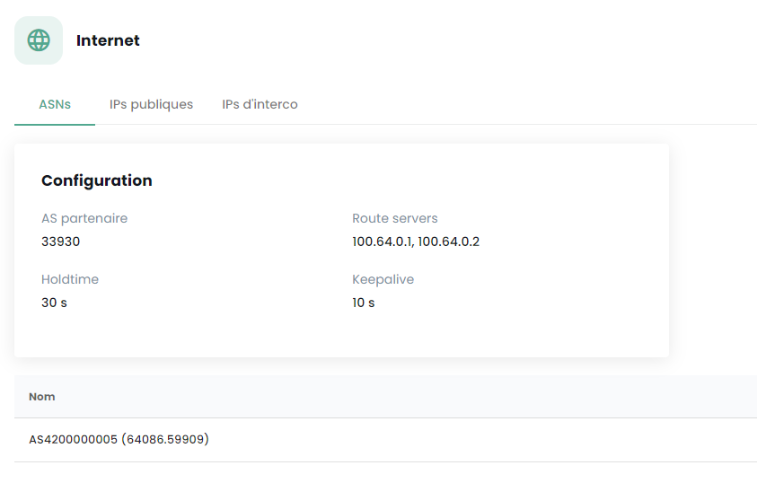

Vous devez aussi disposer Disposer d'une plage d\adresses IP publiques dont l'étendue est en rapport avec votre besoin. La plage d'adresse réservée est indiquée dans la console Cloud Temple à la section Network → Internet → IP publiques. Voici un exemple :

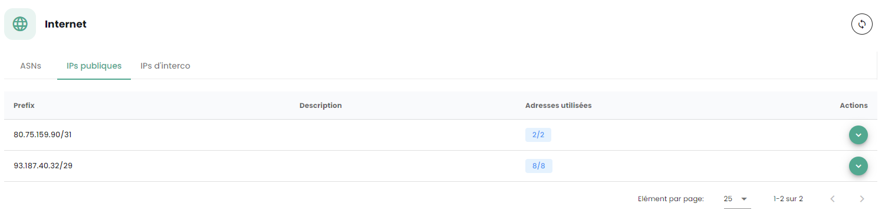

Enfin, vous devez disposez du bloc qui vous est allouée sur le réseau d'interconnexion BGP afin de pouvoir bénéficier d'une route vers Internet. Le réseau d'interconnexion Cloud Temple est le 100.64.0.0/16 et chaque accès bénéficie d'un sous réseau d'interconnexion de type /28. Ce réseau sert à l'établissement de la session BGP avec le coeur de routage Cloud Temple. Vous trouverez cette plage dans la console Cloud Temple dans la section Network → Internet → IPs d'interconnexions. Voici un exemple :

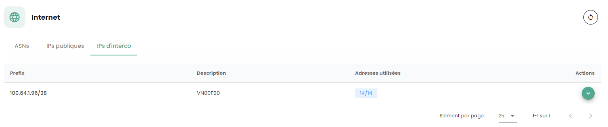

**Remarque :** *Vous devez avoir souscrit aux unités d'oeuvres associées de connectivité Internet. Vous voyez alors apparaître les informations de connectivité dans la console Cloud Temple.*

## Architecture réseau type 

L'architecture type d'un déploiement Cloud Temple est de type Cluster en continuité d'activité. Il implique la mise en oeuvre et la souscription à au moins 2 zones de disponibilité dans une région. 

Le déploiement standard des pare-feux s'effectue en cluster, avec un équipement dans chaque zone de disponibilité SNC. Un réseau virtuel assure la synchronisation du cluster. Les ports WAN accèdent à Internet via le réseau d'interconnexion.

Une configuration initiale est nécessaire pour établir les sessions BGP, permettant ainsi la connectivité Internet. Les VLAN privés sont acheminés vers les interfaces LAN du pare-feu virtuel via un trunk (aggrégation de réseaux de niveaux 2 via la technologie 802.1q).

**Remarque :** *Bien que ce ne soit pas une architecture recommandée, ce guide s'applique aussi aux déploiements mono-AZ.*

## Importer l'appliance Fortinet dans la console Cloud Temple

### Décompression du fichier appliance

Après téléchargement depuis le site de support Fortinet, décompressez le fichier ZIP pour obtenir :

- Les disques virtuels VMDK de l'appliance,

- Les fichiers OVF décrivant l'appliance pour différents formats de matériel virtuel VMware.
  


Voici les types de template couramment intégré dans le .ZIP :

| Template                     | Compatible with                           |
| ---------------------------- | ----------------------------------------- |
| FortiGate-VM64.ovf           | ESXI 8.0(Hardware Version 20) or later    |
| FortiGate-VM64.hw13.ovf      | ESXI 6.5(Hardware Version 13) or later    |
| FortiGate-VM64.hw15.ovf      | ESXI 6.7U2+(Hardware Version 15) or later |
| FortiGate-VM64.hw17.ovf      | ESXI 7.0(Hardware Version 17) or later    |
| FortiGate-VM64.vapp.ovf      | ESXI 8.0(Hardware Version 20) or later    |
| FortiGate-VM64.nsxt.ovf      | ESXI 6.7U2+(Hardware Version 15) or later |
| FortiGate-VM64-ZNTA.vapp.ovf | ESXI 7.0(Hardware Version 17) or later    |

### Importer l'appliance dans votre catalogue d'image via la console Cloud Temple

Connectez vous à votre tenant au sein de la console Cloud Temple, puis aller dans "**Catalogue**" et "**Publier des fichiers**" :

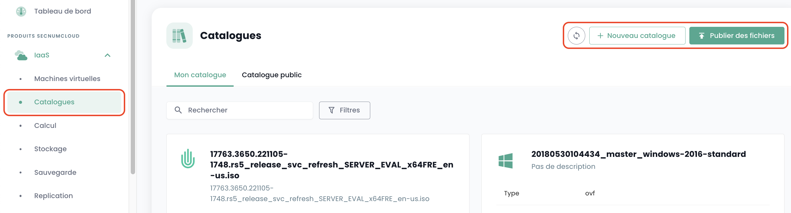

Choisissez un nom pour votre image. Nous vous recommandons d'utiliser : **FGT-VM-VERSION-AZ**, par exemple ici FGT-VM-*7.2.8*-*TH3S* :


Indiquez ensuite la librairie d'image de la zone de disponibilité **(1)**:

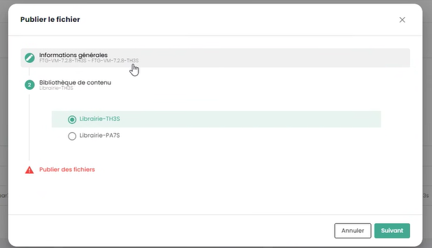

Choisissez ensuite les fichiers à publier dans la librairie **(2)**:

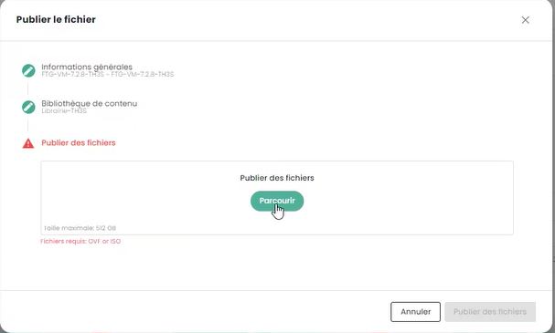


Cliquer ensuite sur "**publier des fichiers**" :

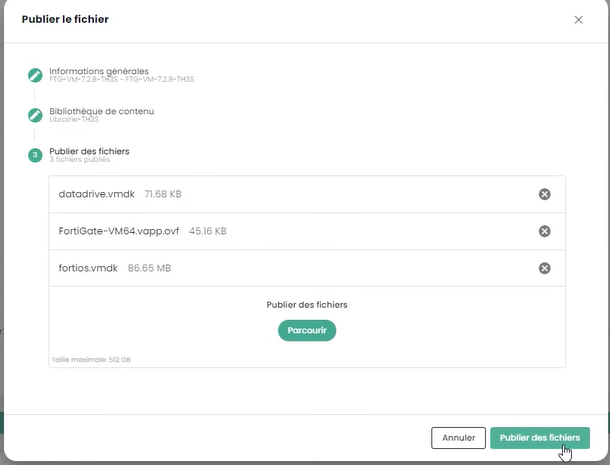

Attendre la fin du téléchargement de vos fichiers dans la librairie :

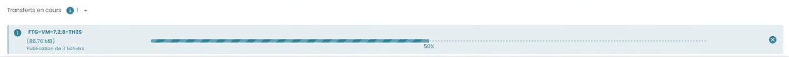


*L'opération est à répéter pour chaque zone de disponibilité où vous souhaitez déployer une appliance.*

Par exemple pour la seconde zone PAR7S :


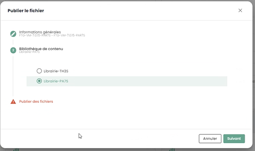

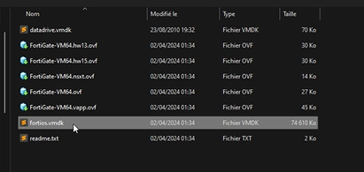

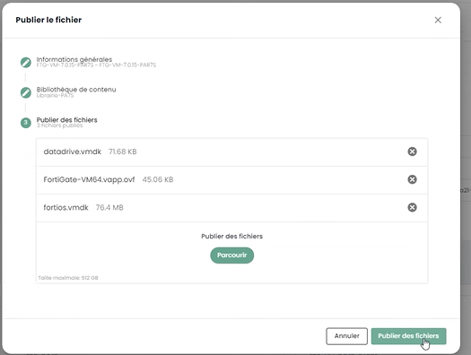

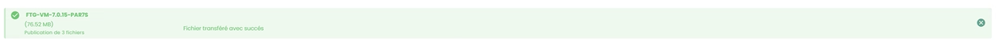


**Remarque :** 

- _**(1)**_ *Chaque zone de disponibilité dispose d'une librairie d'image pour les hyperviseurs de cette zone.*
  
- _**(2)**_ *pour le fichier .ovf, prendre une version dont le hardware virtuel est en version compatible avec la version des hyperviseurs ESXi (au 1° juillet 2024, la version maximale supportée est la __v19__ correspondant aux ESX 7.0.x.).*

## Déploiement de l'appliance Fortinet sur une zone de disponibilité

### Planifier le déploiement de votre interconnexion BGP

Vous devez sélectionner une adresse IP d'interconnexion pour votre future appliance Firewall. La première adresse est toujours la gateway BGP Cloud Temple. Les autres adresses sont donc en principe disponibles (sauf si vous avez précédemment déployer d'autres équipements) :


La règle veut que l'on prenne les IP libres à la suite :


### Planifier l'usage de vos adresses IP publiques

Toutes les IP publiques allouées sont utilisables pour votre tenant. La taille du sous réseau dépend des unités d'oeuvres souscrites.

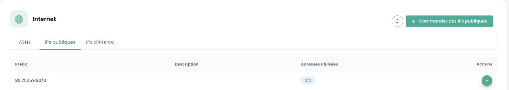

### Paramètres de configuration BGP4

Notez les 3 informations importantes suivantes pour la suite de la configuration BGP4 :

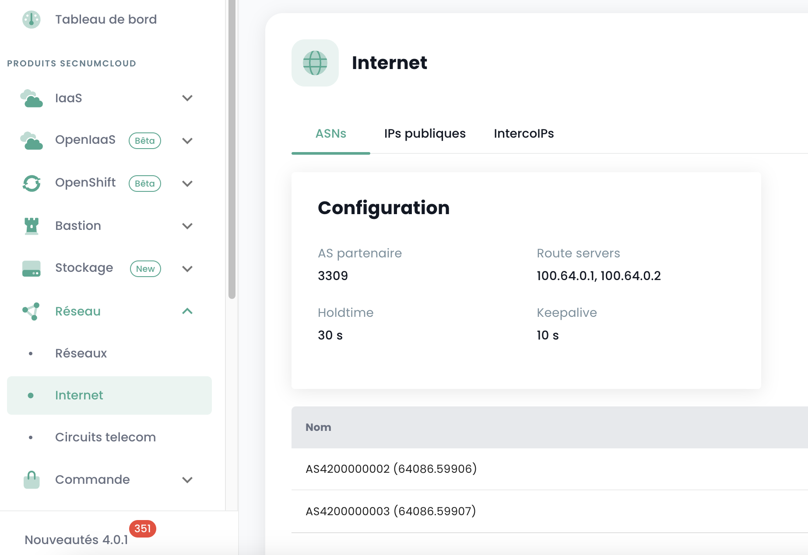

- **AS Partenaire** : le remote AS utilisé pour monter la session BGP du point de vue du firewall, il s'agit de l'AS Cloud Temple.

- **Route Servers** : les deux peers BGP vers lesquels monter une session BGP.
  
- **Nom** : le numéro d\'AS propre au tenant; enlever le préfix *AS* pour ne conserver que le numéro.

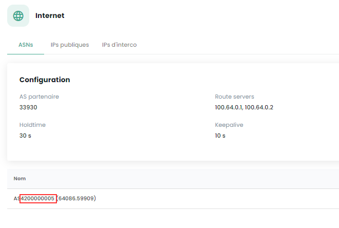

### Déployer l'appliance sur l'infrastructure

Depuis la libraire de la zone de disponibilité sur laquelle vous souhaitez installer votre appliance, sélectionner le template puis "**Déployer**" :


Vous devez ensuite nommer la machine virtuelle; nous vous conseillons la nomenclature suivante : FGT-VM-**0X**-**ROLE**-**AZ**

- **0X** :correspond au type de licence Fortigate auquel vous avez souscris :

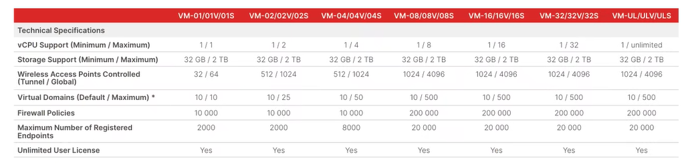

- **ROLE** : Par exemple INTERNET pour un firewall d'interconnexion INTERNET.

- **AZ** : La zone de disponibilité 

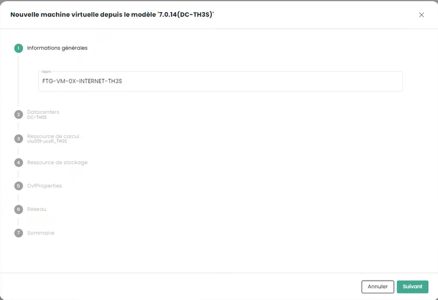

Choisisez ensuite la zone de disponibilité :


Puis le cluster d'hyperviseur cible :

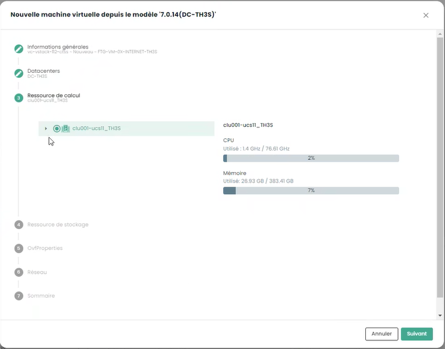

Choisissez la cible de stockage :

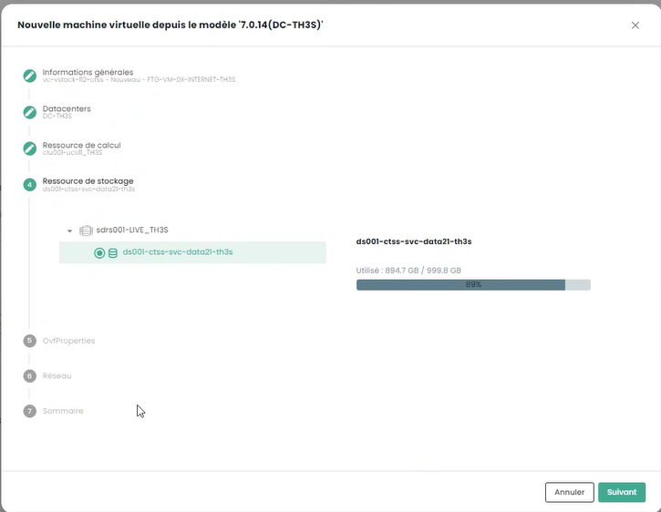

Indiquez enfin les informations de configuration de votre appliance et notamment les informations d'adressage obtenues précédemment :

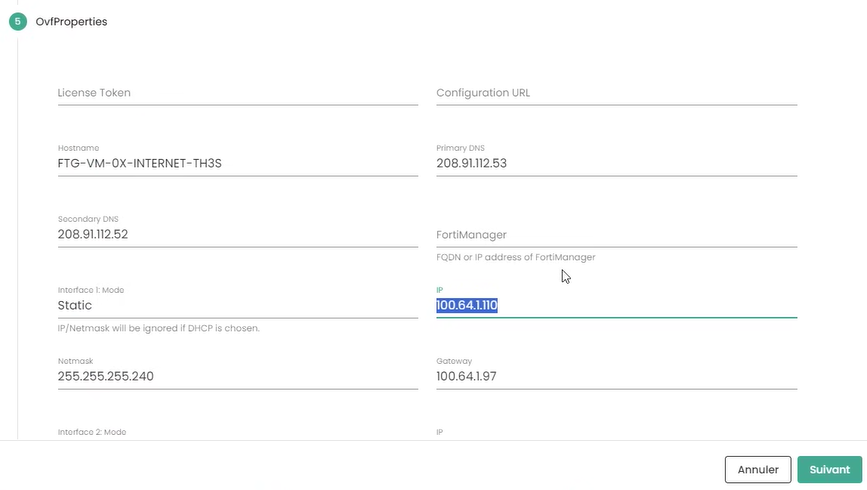

- **Token** : ne rien indiquer

- **Configuration URL** : ne rien indiquer

- **Hostname** : identique au nom de l'enveloppe de la VM

- **DNS** : 208.91.112.53 et 208.91.112.2 (par défaut, mais vous pouvez décider d'utiliser d'autre DNS à votre convenance)

- **Interface IP** : première IP d'interconnexion libre

- **Netmask** : netmask de la plage d'interconnexion

- **Interface 2** : non configurée

Cliquez ensuite sur **Suivant**. Les informations de configuration des interfaces sont à renseigner. La première interface est à utiliser pour l'accès internet; les autres sont temporairement mise sur le vlan dédiée à la haute disponibilité : 


enfin, cliquer sur "**Deployer**".

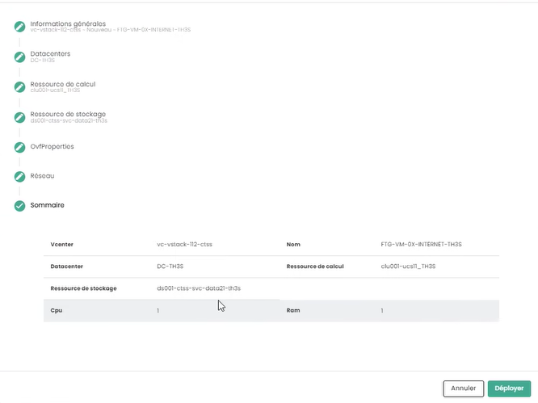

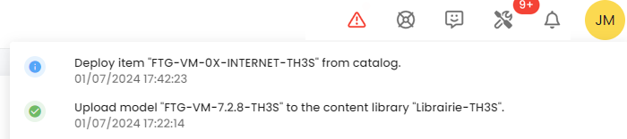

Lorsque le déploiement est terminé, la console Cloud Temple vous l'indique :

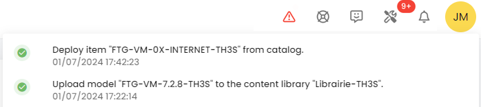

Votre appliance est désormais visible dans les machines virtuelles :

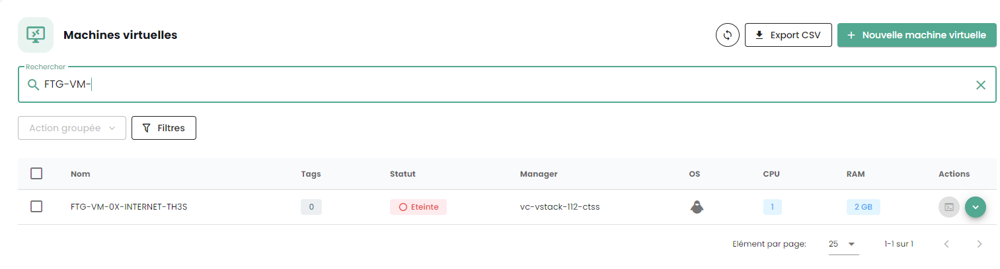

### Affectation d'une politique de sauvegarde

En environnement SecNumCloud, une machine virtuelle doit avoir une politique de sauvegarde pour démarrer. Vous pouvez la configurer dans les politiques et lancer la tache d'inventaire : 

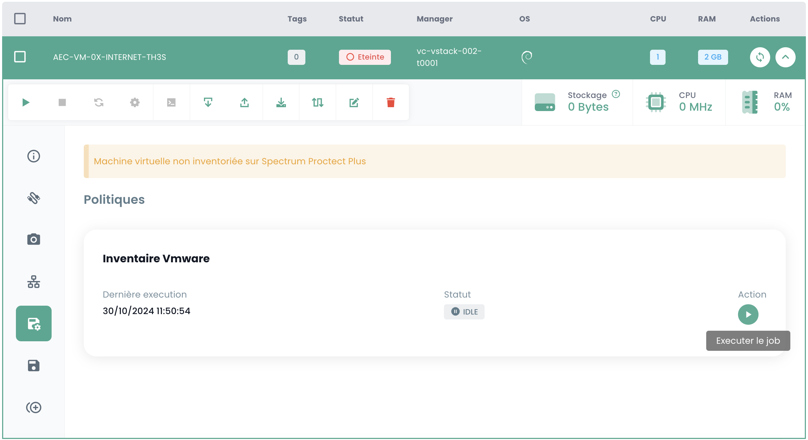

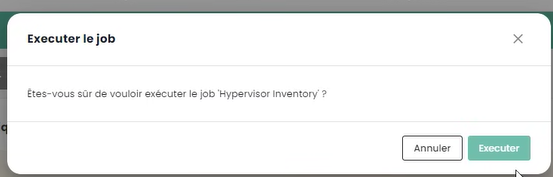

Affecter la politique correspondant au RPO désiré, par défaut vous pouvez choisir une politique quotidienne :

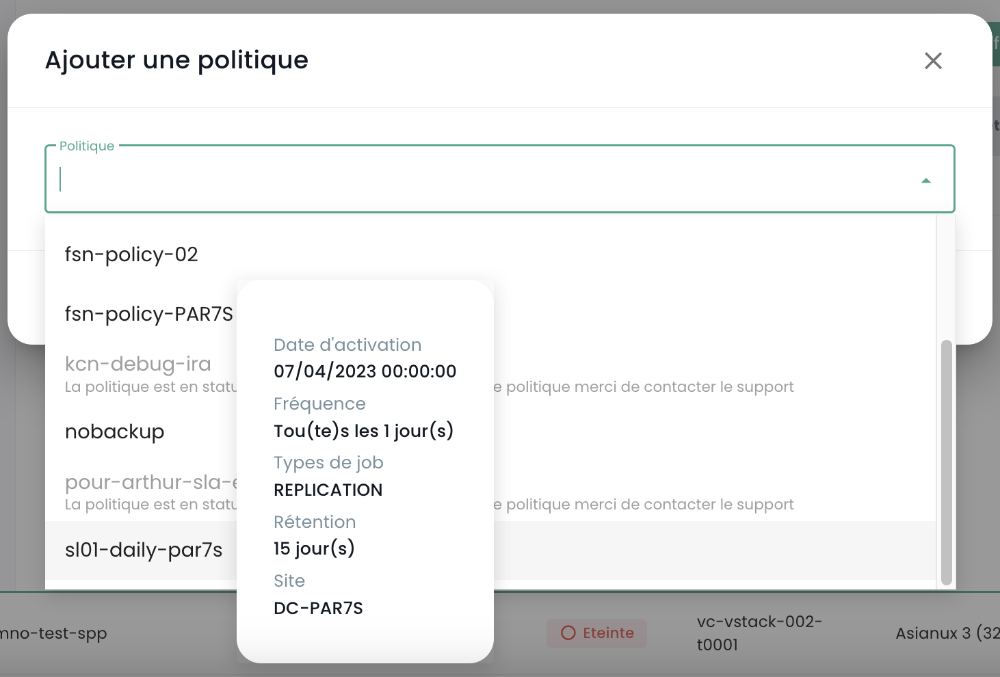

Vous pouvez confirmer votre choix :

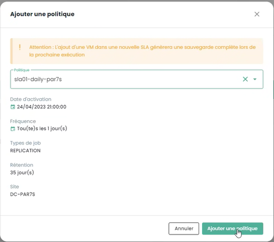

Si des politiques supplémentaires sont requises (comme dans cet exemple 'daily' et 'monthly'), répétez l'opération pour chaque politique additionnelle.

### Démarrage de la machine virtuelle

Le démarrage de la machine virtuelle se fait depuis la console Cloud Temple :


Il est possible d'observer la console et l'appliance Fortinet reboot à nouveau à l'issue du premier Boot :


Après ce second boot, l'adresse IP indiquée dans le déploiement de la machine virtuelle à la section **OvfProperties**, doit répondre au ping sous réserve d'un accès au réseau d'interconnexion.

## Configuration initiale 

### Connexion à la console 

Dans la console Cloud Temple, sélectionnez votre appliance Fortinet et demander la console de l'appliance.


En fonction du moment au vous avez accédez à la console, vous avez pu voir le boot et reboot initiaux de celle ci : 


Vous pouvez ensuite vous connecter sur la console de l'appliance, le nom d'utilisateur est "**admin**". L'appliance vous demander de changer le mot de passe (il n'y en a pas par défaut, juste appuyer sur ENTER). 

Vous devez alors entrer un nouveau mot de passe. 

**Attention : L'appliance est en clavier QWERTY.** 

**En cas d'erreur de mot de passe, vous devrez réinstaller votre appliance.**


### Configuration de la session BGP

Dans cette étape, nous allons configurer en mode console votre appliance Fortinet pour monter le lien BGP4

#### Configuration du range d'IPs Publiques

La première étape consiste à définir les plages d'adresses IP publiques. Pour débuter, nous configurerons uniquement le premier bloc. Nous utiliserons les informations que vous avez précédemment notées.

    config router prefix-list
        edit "pfx_net_public_customer"
        config rule
        edit 1
            set prefix 80.75.159.90/31
                unset ge
                set le 32
            next
        edit 100
            set action deny
            set prefix 0.0.0.0 0.0.0.0
                unset ge
                unset le
            next
        end
    next
    edit "pfx_deny_all"
        config rule
            edit 1
                set action deny
                set prefix 0.0.0.0 0.0.0.0
                unset ge
                unset le
        next
        end
    next
    end

Vous pouvez alors vérifier que la configuration s'est bien réalisée avec la commande :

    show router prefix-list

#### Configuration de la route map

Une "route map policy" sert à définir des politiques de routage plus complexes qui peuvent influencer ou modifier le comportement du trafic réseau basé sur des critères spécifiques. Les route maps sont particulièrement utiles pour des tâches avancées de gestion de trafic, telles que le filtrage de routes, la redirection de trafic, ou la modification d'attributs de route dans des protocoles de routage dynamique comme BGP (Border Gateway Protocol). Dans notre contexte, elle vise a sécurité votre réseau des annonces non valides.

La seconde étape consiste a configurer la route map policy :

    config router route-map
        edit "rm_deny_all"
            config rule
            edit 1
                set match-ip-address "pfx_deny_all"
            next
        end
        next
        edit "rm_net_public_customer"
            config rule
            edit 1
                set match-ip-address "pfx_net_public_customer"
            next
        end
        next
    end

Vous pouvez alors vérifier que la configuration s'est bien réalisée avec la commande :

    show router route-map

#### Configuration de l'annonce BGP

Nous allons maintenant configurer l'annonce BGP. Vous devez avoir en votre possession, comme vu plus haut dans ce guide, l'ip d'interconnexion (ici, le router-id), l'adresse IP du peer BGP4 (ici, **100.64.0.1** et **100.64.0.2**), le local AS (ici **4200000005**) et la plage IP Publique précédemment configurée. _**Souvenez vous**_ : 


et


Dans cette configuration, l'AS (autonomous system) de Cloud Temple est le 33930. L'AS 65001 est un AS privé qui vous représente. L'utilisation à ce niveau d'un numéro d'AS privé est plus propre en particulier si plusieurs connexions BGP sont à configurer.

    config router bgp
        set as 65001                                                                    
        set router-id **100.64.1.110**                                                     
        set network-import-check disable                                                    
        set graceful-restart enable                                                           
        config neighbor
            edit "100.64.0.1" 
                set capability-graceful-restart enable
                set ebgp-enforce-multihop enable
                set next-hop-self enable
                set soft-reconfiguration enable
                set ebgp-multihop-ttl 3
                set remote-as 33930
                set local-as 4200000005
                set route-map-in "rm_deny_all"
                set route-map-out "rm_net_public_customer"
                set keep-alive-timer 10
                set holdtime-timer 30
            next
            edit "100.64.0.2"
                set capability-graceful-restart enable
                set ebgp-enforce-multihop enable
                set next-hop-self enable
                set soft-reconfiguration enable
                set ebgp-multihop-ttl 3
                set remote-as 33930
                set local-as 4200000005
                set route-map-in \"rm_deny_all\"
                set route-map-out \"rm_net_public_customer\"
                set keep-alive-timer 10
                set holdtime-timer 30
            next
        end

    config network
        edit 1
            set prefix 80.75.159.90/31
        next
    end
    config redistribute "connected"
    end
    config redistribute "static"
        set status enable
    end
    end

Vous pouvez ensuite vérifier que les sessions BGP sont montées : 

    get router info bgp summary

#### Configuration de l'adresse de LoopBack

En utilisant l'adresse de loopback pour établir des sessions BGP entre pairs, la stabilité de la session est améliorée. Les adresses de loopback ne dépendent pas de l'état d'une interface physique spécifique. Par conséquent, même si une interface tombe en panne ou si un chemin est interrompu, la session BGP peut rester active tant qu'il existe un autre chemin de routage valide entre les pairs. Cela augmente la redondance et la résilience du réseau.

Utiliser des adresses de loopback pour les sessions BGP permet également d'aider à renforcer la sécurité. Les politiques de sécurité peuvent être appliquées de manière plus uniforme et efficace aux adresses de loopback, et des mesures de sécurité supplémentaires comme l'authentification et les listes de contrôle d'accès peuvent être plus facilement mises en œuvre.

Nous conseillons de nommer l'adresse de LoopBack en utilisant la première IP publique du premier range, qui devrait être l'adresse par défaut pour sortir sur Internet : **LOOP_"AVANT DERNIER OCTET DE L'IP PUBLIQUE"_"DERNIER OCTET DE L'IP PUBLIQUE"**

Par exemple, si votre première IP Publique de votre premier range est 80.75.159.90/32, la loopback est nommée **LOOP_159.90**.
Dans la ligne de commande de votre appliance, tapez (**Attention 80.75.159.90/32 est ici un exemple !**): 

```
    config system interface 
        edit "LOOP_159_90"
        set vdom "root"
        set ip 80.75.159.90/32
        set allowaccess ping
        set type loopback
        next
    end
    config firewall ippool
        edit "NAT-PUB-ALL"
        set startip 80.75.159.90
        set endip 80.75.159.90
        next
    end
    config system dns
        set primary 96.45.45.45
        set secondary 96.45.46.46
        set source-ip 80.75.159.90
    end
    config system fortiguard
        set update-server-location eu
        set source-ip 80.75.159.90
    end
    config system ntp
        set ntpsync enable
        set source-ip 80.75.159.90
    end
```

Cela permet la configuration initiale du NAT, du DNS, de la prévention d'intrusion et de l'horloge. Désormais, votre appliance doit pouvoir pinger l'extérieur si l'adresse IP source est l'IP de NAT (ici dans cet exemple 80.57.159.90).

**Nous conseillons aussi de changer le port d'administration, qui est par défaut 80 ou 443.**

#### Configuration des interfaces WAN et HA

Afin de simplifier la lisibilité des interfaces dans l'administration des équipements, nous recommandons de renommer les interfaces pour que leur nom corresponde à leur rôle sur le firewall. Cela se fait via la définition d'un alias sur l'interface.

Le port1 est défini comme WAN et le port2 est renommé HA. Pour le port de HA, une adresse IP dans le subnet APIPA est définie afin que les équipements puisse se joindre de cette façon une fois en cluster.

```
config system interface
        edit "port1"
                set alias "WAN"
        next
        edit "port2"
                set ip 169.254.254.1 255.255.255.252
                set allowaccess ping
                set type physical
                set alias "HA"
                set snmp-index 2
        next
end
```

### Déploiement d'un second membre

#### Déploiement de la seconde VM

Pour déployer un second membre pour la mise en cluster, il est recommandé de disposer d'une seconde AZ afin d'assurer une haute disponibilité du cluster de firewall. 

Il conviendra pour le déploiement de la seconde appliance, de répéter les actions de déploiement indiquées précédemment dans la seconde AZ :
- Ajout du template OVF dans une bibliothèque de contenu
- Déploiement d'une VM depuis cette bibliotèque de contenu
- Affectation d'une politique de sauvegarde

Nous recommandons de conserver la politique de nommage de la VM, à savoir FGT-VM-0X-ROLE-AZ et pour l'adresse IP de la première interface, il s'agira d'utiliser la seconde IP libre de la plage d'interconnexion.

#### Configuration des interfaces WAN et HA

Toujours dans l'optique de simplifier la lisibilité des interfaces, celles-ci doivent être renommées sur le second membre. Il conviendra également lors de cette étape de configurer l'adresse IP de l'interface de HA afin que les équipements puissent communiquer pour la mise en cluster.

```
config system interface
        edit "port1"
                set alias "WAN"
        next
        edit "port2"
                set ip 169.254.254.2 255.255.255.252
                set allowaccess ping
                set type physical
                set alias "HA"
                set snmp-index 2
        next
end
```

### Mise en cluster

Nous allons configurer un clustering Actif/Passif. Le mot de passe constitue une clé partagée entre les deux membres du cluster et devra être conservé de manière sécurisée. La communication entre les équipements se fait en unicast et donc la peer IP à indiquer est celle de l'interface HA du firewall avec lequel établir le cluster.
Enfin, les interfaces mentionnées dans la section *monitor* sont les interfaces supervisées, si le lien L2 est perdu, cela déclenche une bascule du cluster.

Sur le premier équipement, cela donne cette configuration :

```
config system ha
    set mode a-p
	set group-name "FTG-HA-INTERNET"
    set group-id 16
    set password SECRET
    set hbdev HA 10
	set priority 100
    set monitor "HA" "WAN"
    set unicast-hb enable
    set unicast-hb-peerip 169.254.254.2
end 
```

Enfin, sur le second, nous allons changer l'adresse IP du peer et baisser la priorité afin que le premier équipement soit élu par défaut comme membre actif du cluster :

```
config system ha
    set mode a-p
	set group-name "FTG-HA-INTERNET"
    set group-id 16
    set password SECRET
    set hbdev HA 10
	set priority 200
    set monitor "HA" "WAN"
    set unicast-hb enable
    set unicast-hb-peerip 169.254.254.1
end 
```

La synchronisation peut mettre quelques minutes à s'établir. 
Pour une vérification complète, la commande *get sys ha status* est la commande indiquée. Pour vérifier de manière plus succinte, il faut faire *diag sys ha checksum cluster*
Lorsque la synchronisation est fonctionnelle, les checksum de la ligne *all* doivent être identiques sur les deux équipements.

```
# diag sys ha checksum cluster

================== FG3H0ZZZNNNNNNN1 ==================

is_manage_primary()=1, is_root_primary()=1
debugzone
global: 2e b4 fb 43 fb 7a 98 7f db ed c0 47 5b 35 e4 1f 
root: bb 66 88 7d df ab 27 f0 b3 a8 a7 72 f4 a0 f3 2d 
all: c9 4b 3b e2 1b e6 25 89 df d2 95 31 ba 8b 47 bb 

checksum
global: 2e b4 fb 43 fb 7a 98 7f db ed c0 47 5b 35 e4 1f 
root: bb 66 88 7d df ab 27 f0 b3 a8 a7 72 f4 a0 f3 2d 
all: c9 4b 3b e2 1b e6 25 89 df d2 95 31 ba 8b 47 bb 

================== FG3H0ZZZNNNNNNN2 ==================

is_manage_primary()=0, is_root_primary()=0
debugzone
global: 2e b4 fb 43 fb 7a 98 7f db ed c0 47 5b 35 e4 1f 
root: bb 66 88 7d df ab 27 f0 b3 a8 a7 72 f4 a0 f3 2d 
all: c9 4b 3b e2 1b e6 25 89 df d2 95 31 ba 8b 47 bb 

checksum
global: 2e b4 fb 43 fb 7a 98 7f db ed c0 47 5b 35 e4 1f 
root: bb 66 88 7d df ab 27 f0 b3 a8 a7 72 f4 a0 f3 2d 
all: c9 4b 3b e2 1b e6 25 89 df d2 95 31 ba 8b 47 bb 
```


#### Configuration des accès externes sur le firewall


Premièrement, on déplace le port d'administration du port 443 sur le port 8443 afin de permettre la libération d'un port standard pouvant être utilisé pour des utilisations métier.
```
config system global
	set admin-sport 8443
end
```

Ajout d'un service custom pour les règles de flux à suivre :
```
config firewall service custom
    edit "TCP-8443"
        set tcp-portrange 8443
    next
end
```

Autorisation de l'administration sur l'interface WAN et sur l'interface loopback. Il sera important à cette étape d'adapter le nom de l'interface LOOP telle que définie précédemment :
```
edit port1
	set allowaccess ping https ssh http
next

config system interface 
	edit "LOOP_0"
        set allowaccess ping https ssh http snmp
	next
end
```

On créé ensuite une règle de flux qui autorise l'accès aux interfaces d'administration sur l'interface loopback. Cette règle est très permissive, elle autoriser toutes les adresses IP, il convient de filtrer ensuite sur des plages explicitement permises.
```
config firewall policy
    edit 1
        set name "WAN to LOOP"
        set srcintf "port1"
        set dstintf "LOOP_0"
        set action accept
        set srcaddr "all"
        set dstaddr "all"
        set schedule "always"
        set service "ALL_ICMP" "HTTP" "HTTPS" "SSH" "TCP-8443"
    next
end
```

Enfin, on restreint l'authentification du compte admin à des plages d'IP pré-établies. C'est une recommandation forte de sécurité de Cloud Temple.
```
config system admin
    edit "admin"
        set trusthost1 100.64.1.99/32
        set trusthost2 1.2.3.4/32
        set trusthost3 5.6.7.8/32
        set accprofile "super_admin"
        set vdom "root"
        set password SECRET
     next
end
```