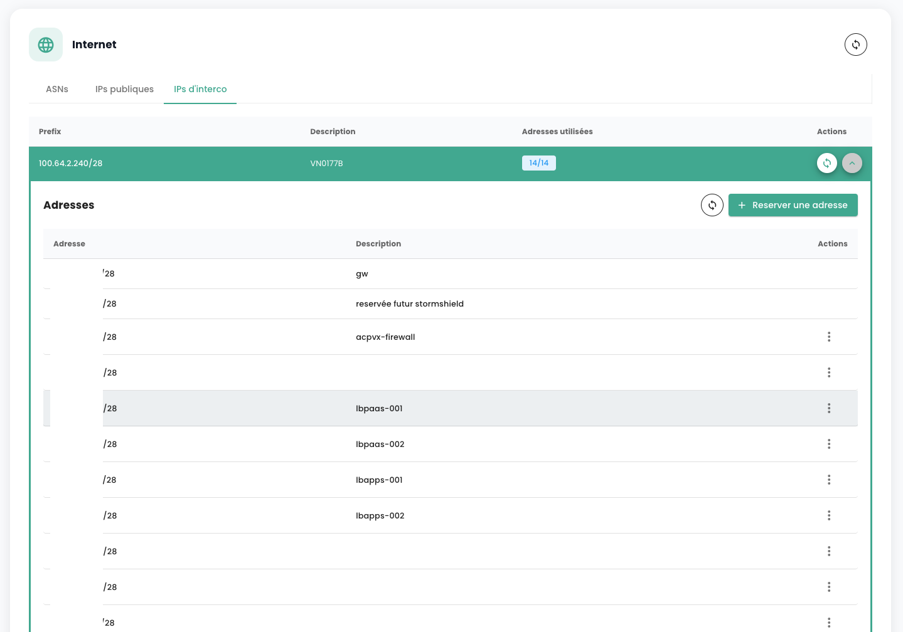

## Managing Your Internet Connectivities

Connectivity management is performed via the **'Network'** > **'Internet'** menu. This menu centralizes IP address management and offers two distinct categories:

1. **Public IP Addresses**: These are used to expose your services on the Internet, facilitating incoming and outgoing data exchanges.
2. **Interconnection IP Addresses**: These addresses allow your gateways to route traffic to the specific Cloud Temple network, ensuring a secure and efficient connection.

Public IP addresses enable Internet access, while interconnection IP addresses used with the BGP4 protocol ensure secure network connections. The latter facilitate reliable and secure exchanges between your tenant and the Cloud Temple network. The combined use of these addresses improves traffic management and strengthens network security and performance.

Here is the main interface for IP address management:

The home tab corresponds to your internal ASN dedicated to your tenant. It indicates important information for configuring your BGP connectivity.

### Public IP Addresses

It is possible to view and comment on the IP blocks and addresses associated with your tenant via the IPAM integrated into the Cloud Temple console:

Public IP address ordering is done via the **'Order Public IPs'** button:

Reservation and allocation of an IP address are done via the **'Reserve an Address'** button:

Modification or deletion of the reservation is done via the **'Actions'** buttons:

Deleting a reservation means that the resource becomes available for another use but remains allocated and billed to the client.

On some lines, the **'Action'** button is not available, indicating that the IP addresses are reserved and thus not available for use.

### Interconnection IP Addresses

Similarly, you can view and comment on interconnection IP blocks. You can view the interconnection sub-networks with the Cloud Temple network and their usage:

You can easily modify, as with public addresses, their usage in the integrated IPAM management:

