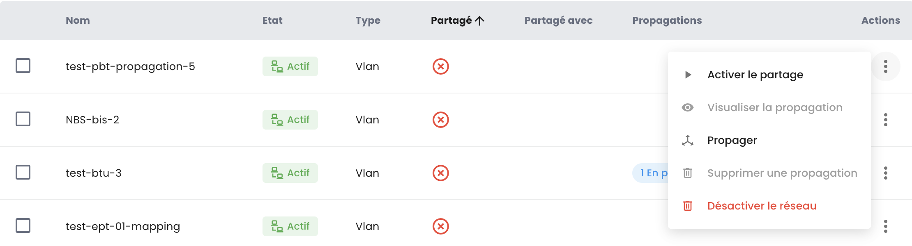

## Regional Private Networks

The command for private networks within a region is executed directly in the Cloud Temple console.

### Within a tenant

The creation of a virtual network is done in the __*Network*__ menu on the green banner to the left of the screen.

Then click on the __*New Network*__ button.

You need to specify the name of your network which will be displayed. By default, all of your clusters will access your new network.
However, in the __*Advanced Options*__ submenu, you can more finely specify the scope of propagation within the tenant between your different clusters.

All possible actions on your networks can be found in the __*Actions*__ menu of each of them:

- Enabling the sharing of a network between tenants of the same organization.
- Disabling the sharing of a network between tenants of the same organization.
- Adding the sharing of a network between tenants of the same organization.
- Removing the sharing of a network between tenants of the same organization.
- Graphical visualization of the propagation of a network across all your clusters and hypervisors within a tenant.
- Removing propagation within a tenant.
- Modifying propagation within a tenant.
- Removing a network.

#### Visualization of your networks' propagation

You can easily visualize the propagation of a network to your different clusters within the same tenant in the __*Actions*__ menu:
Choose the option *"Visualize Propagation"*:

 

#### Modification of propagation

The modification of propagation within a tenant is done via the *"Propagate"* option:
then choose the clusters to be included in this propagation.

__*Note:*__ *Propagation modification is limited to 20 networks per action.*

#### Deletion of a network

The deletion of a network within a tenant is done via the *"Delete Network"* option:

### Network sharing between tenants

By default, __networks are only available within a tenant__. You can choose to __share a network between multiple tenants__ for technical or connectivity reasons.
It is thus possible to share a network between your __[tenants](../../console/tenants.md)__ within the same organization.

Simply activate the sharing as shown below.

Once sharing activation is done, you just need to add a share as shown below.

Then, select the target tenant. Note that the list of tenants is dynamic.
It depends on your organization and your rights.

Once the network is shared, it will be visible in the 'Shared Networks' tab from your second tenant.

