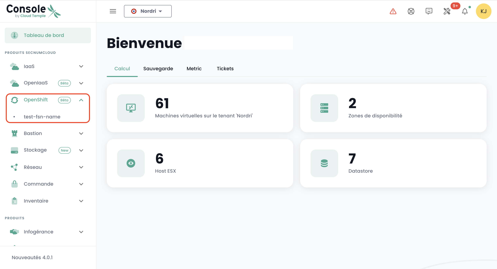

## Deploy a Redhat Openshift platform within your tenant

### Assigning access rights

It is essential that the administrator of the [tenant](../console/tenants.md) grants the management right of the Openshift platform to the Openshift administrator user to be able to access it:

### Accessing the Openshift environment within a tenant

After assigning the rights, the '__Openshift__' module then appears in the Cloud Temple console menu:

You will then see the Openshift clusters that are deployed within your tenant.

Click on the cluster you wish to administer. You will access the cluster administration environment:

After authentication, you can administer your cluster:

