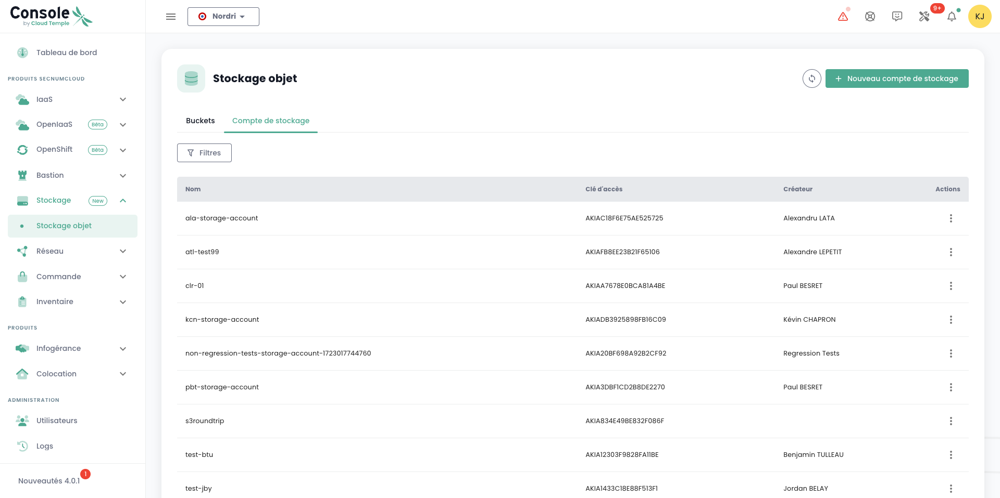
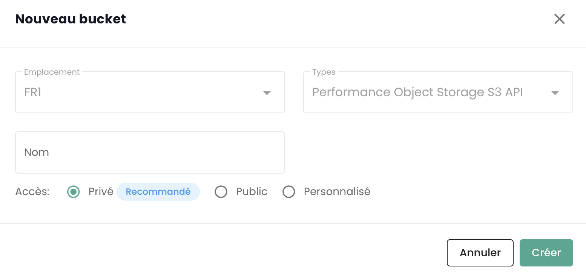
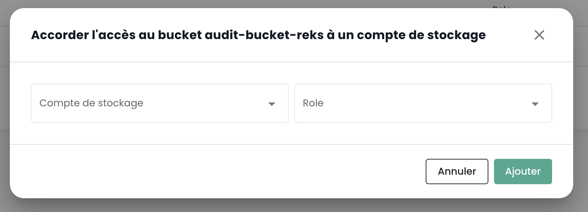
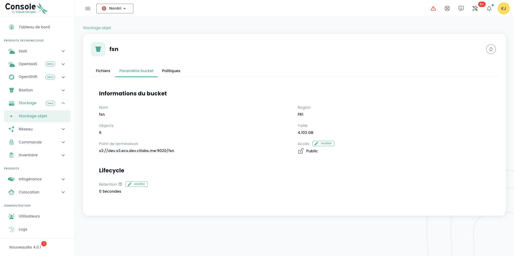
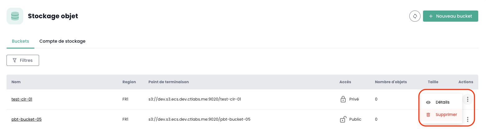

## Listing all S3 buckets in your tenant

You can access all your buckets via the '__Object Storage__' menu in the Cloud Temple console:

You can view all accounts created on your tenant and authorized to access the S3 service via the '__Storage Accounts__' tab.

## Creating a new storage account

Creating a storage account on your tenant is done by clicking on the '__New Storage Account__' button at the top right, in the '__Storage Accounts__' tab:

The platform then provides you with the access key and secret key for your bucket:

__WARNING:__ The secret and access keys are displayed only once. After this initial display, it becomes impossible to view the secret key again. It is therefore essential to note down this information immediately; otherwise, you will need to generate a new pair of keys.

Regeneration is done in the key options by choosing the "Reset Access Key" option.

## Creating an S3 bucket 

Creating a new bucket is done by clicking on the '__New bucket__' button at the top right of the screen:

A window then appears and you must provide:

1. The **region** where your bucket will be created,
2. The **type** of bucket: performance or archive,
3. The **name** of your bucket (it must be unique).

As of April 3, 2024, the available region is **FR1** (Paris) and only the performance type is available.
You also need to choose who can access your bucket:

- **Private** Access: By default, access is limited to specific IP addresses of Cloud Temple.
- **Public** Access: Access is open to all Internet addresses (including via the 0.0.0.0/0 rule). We advise against this configuration due to its security implications.
- **Custom** Access: This option allows you to specify the IPv4 addresses or subnet ranges you want to allow.

## Associating a storage account with a bucket

Account associations with buckets are made in the '__Policies__' tab

This association allows the storage account access to the bucket. There are three roles:

1. **Maintainer**: Read, write, rights management, and policy management permissions.
2. **Reader**: Read files in the buckets and download them.
3. **Writer**: Read, edit, modify, delete files in buckets.

## Browsing an S3 Bucket

When you click on a bucket's name, you first access the '__Files__' tab to view its content:

In the '__Settings__' tab, you can see the details of your S3 bucket:

You then have:

1. The name of the S3 bucket,
2. Its region,
3. The number of objects it contains and the size of the bucket in bytes,
4. Its endpoint,
5. The lifecycle settings that define, among other things, the expiration of the bucket's objects. '__0__' corresponds to infinite retention.

You can modify the retention setting via the '__Edit__' button of the lifecycle:

Finally, you can modify its access typology.

## Limitations of Access to Your S3 Buckets
It is very straightforward to set up access restrictions for your S3 buckets. When creating a bucket, you have the choice between three access configurations:

- **Private** Access: By default, access is limited to specific IP addresses of Cloud Temple.
- **Public** Access: Access is open to all Internet addresses (including via the 0.0.0.0/0 rule). We discourage this configuration due to its security implications.
- **Custom** Access: This option allows you to specify the IPv4 addresses or subnet ranges that you wish to authorize:

*IPv6 support is planned for the first half of 2025.*

## Deleting an S3 bucket

Deleting a bucket is done in the actions associated with the bucket by choosing the __'Delete'__ option.

_**WARNING: Deletion is permanent and there is no way to recover the data.**_