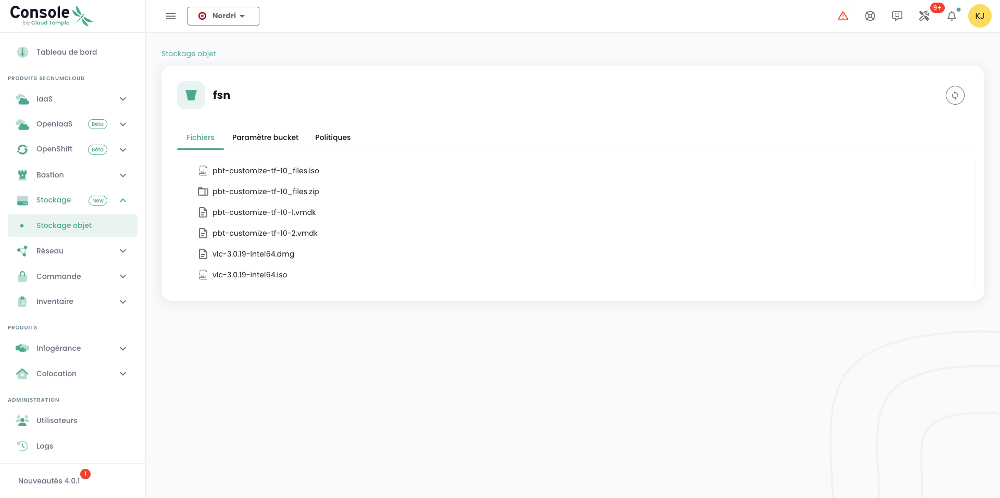

## List all S3 buckets in your tenant

You can access all your buckets via the '__Object Storage__' menu in the Cloud Temple console:

You can see all the accounts created on your tenant and authorized to access the S3 service via the '__Storage Accounts__' tab.

## Creating a new storage account

Creating a storage account on your tenant is done by pressing the '__New Storage Account__' button at the top right, in the '__Storage Accounts__' tab:

The platform then provides you with the access key and the secret key for your bucket:

__ATTENTION:__ The secret and access keys are presented only once. After this initial appearance, it becomes impossible to view the secret key again. Therefore, it is crucial to note this information immediately; otherwise, you will need to generate a new pair of keys.

Key regeneration is done through the key options by selecting the "Reset access key" option.

## Creating an S3 Bucket

Creating a new bucket is done by clicking the '__New bucket__' button at the top right of the screen:

A window then appears and you need to provide:

1. The **region** for creating your bucket,
2. The **type** of bucket: performance or archival,
3. The **name** of your bucket (it must be unique).

As of April 3, 2024, the available region is **FR1** (Paris) and only the performance type is available.
You must also decide who can access your bucket:

- **Private** Access: By default, access is limited to specific Cloud Temple IP addresses.
- **Public** Access: Access is open to all Internet addresses (notably via the rule 0.0.0.0/0). We discourage this configuration due to its security implications.
- **Custom** Access: This option allows you to specify the IPv4 addresses or subnet ranges you wish to authorize.

## Associating a Storage Account to a Bucket

Account-to-bucket associations are performed in the '__Policies__' tab.

This association allows the storage account to access the bucket. There are three roles:

1. **Maintainer**: Read, write, rights management, and policy management privileges.
2. **Reader**: Read and download files in the buckets.
3. **Writer**: Read, edit, modify, and delete files in the buckets.

## Browse an S3 bucket

When you click on a bucket name, you first access the '__Files__' tab to see its content:

In the '__Settings__' tab you can view the details of your S3 bucket information:

You then have:

1. The name of the S3 bucket,
2. Its region,
3. The number of objects it contains and the size of the bucket in bytes,
4. Its endpoint,
5. The lifecycle settings that define, among other things, the expiration of the bucket's objects. '__0__' corresponds to an infinite retention.

You can modify the retention parameter via the '__Modify__' button in the lifecycle section:

Finally, you can modify its access typology.

## Limitations of access to your S3 buckets
It is very simple to configure access restrictions for your S3 buckets. When creating a bucket, you have the choice of three access configurations:

- **Private** Access: By default, access is limited to specific Cloud Temple IP addresses.
- **Public** Access: Access is open to all Internet addresses (notably through the rule 0.0.0.0/0). We do not recommend this configuration due to its security implications.
- **Custom** Access: This option allows you to specify the IPv4 addresses or subnet ranges that you wish to authorize:

*IPv6 support is planned for the first half of 2025.*

## Deleting an S3 bucket

Deleting a bucket is done through the actions associated with the bucket by selecting the __'Delete'__ option.

_**WARNING: Deletion is permanent and there is no way to recover the data.**_