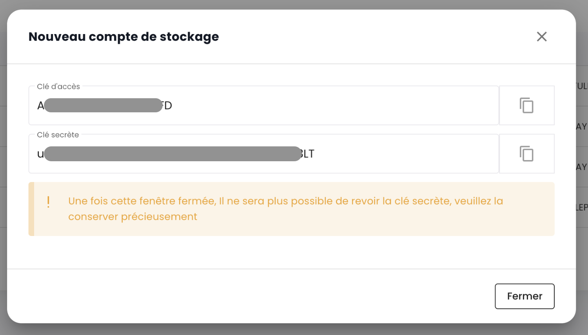
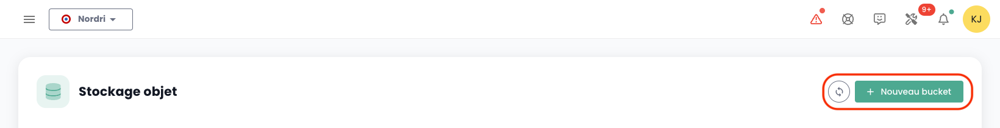
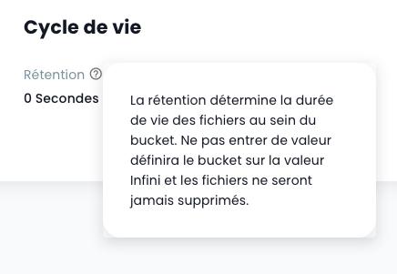

## Lister l'ensemble des bucket S3 de votre tenant

Vous pouvez accéder à l'ensemble de vos buckets via le menu '__Stockage Objet__' de la console Cloud Temple :

Vous pouvez voir tous les comptes créés sur votre tenant et autorisé à accéder au service S3 via l'onglet '__Comptes de stockage__'.

## Création d'un nouveau compte de stockage

La création d'un compte de stockage sur votre tenant se fait en appuyant sur le bouton '__Nouveau compte de stockage__' en haut à droite, dans l'onglet '__Comptes de stockage__' :

La plateforme vous donne alors la clef d'accès et la clef secrète de votre bucket :

__ATTENTION :__ Les clés secrète et d'accès sont présentées une seule fois. Après cette première apparition, il devient impossible de consulter à nouveau la clé secrète. Il est donc essentiel de noter ces informations immédiatement ; faute de quoi, il vous sera nécessaire de générer une nouvelle paire de clés.

La regeneration se fait au niveau des options de la clefs en choisissant l'option "Réinitialiser clé d'accès".

## Création d'un bucket S3 

La création de nouveau bucket se fait en cliquant sur le bouton '__Nouveau bucket__' en haut à droite de l'écran :

Une fenêtre s'affiche alors et vous devez renseigner :

1. La **région** de création de votre bucket,
2. Le **type** de bucket : performant ou archivage,
3. Le **nom** de votre bucket (il doit être unique).

Au 3 Avril 2024, la région disponible est **FR1** (Paris) et seul le type performant est disponible.

Vous devez aussi choisir qui peut accéder à votre bucket :

- Accès **Privé** : Par défaut, l'accès est limité aux adresses IP spécifiques de Cloud Temple.
- Accès **Public** : L'accès est ouvert à toutes les adresses Internet (notamment via la règle 0.0.0.0/0). Nous déconseillons cette configuration en raison de ses implications en termes de sécurité.
- Accès **Personnalisé** : Cette option vous permet de spécifier les adresses IPv4 ou les plages de sous-réseaux que vous souhaitez autoriser.

## Association d'un compte de stockage à un bucket

Les associations de compte aux buckets sont réalisées dans l'onglet '__Politiques__'

Cette association permet de donner l'accès du compte de stockage au bucket. Il y trois rôle :

1. **Maintener** : Les droits lecture, ecriture, gestion des droits et gestion de la politique
2. **Lecteur** : Lire les fichiers dans les buckets et les télécharger.
3. **Ecrivain** : Lire et éditer, modifier, supprimer les fichiers dans les buckets.

## Parcourir un bucket S3

Lorsque vous cliquez sur le nom d'un bucket, vous avez accès en premier à l'onglet '__Fichiers__' pour voir son contenu :

Dans l'onglet '__Paramètres__' vous pouvez voir le détail des informations de votre bucket S3 :

Vous avez alors :

1. Le nom du bucket S3,
2. Sa région
3. Le nombre d'objet qu'il contient et la taille en octets du bucket,
4. Son point de terminaison,
5. Les paramètres de cycle de vie qui définissent notamment l'expiration des objets du bucket. '__0__' correspond à une rétention infinie.

Vous pouvez modifier le paramètre de rétention via le bouton '__Modifier__' du cycle de vie :

Enfin, vous pouvez modifier sa typologie d'accès.

## Limitations des accès à vos bucket S3

Il est très simple de configurer les restrictions d'accès à vos buckets S3. Lors de la création d'un bucket, vous avez le choix entre trois configurations d'accès :

- Accès **Privé** : Par défaut, l'accès est limité aux adresses IP spécifiques de Cloud Temple.
- Accès **Public** : L'accès est ouvert à toutes les adresses Internet (notamment via la règle 0.0.0.0/0). Nous déconseillons cette configuration en raison de ses implications en termes de sécurité.
- Accès **Personnalisé** : Cette option vous permet de spécifier les adresses IPv4 ou les plages de sous-réseaux que vous souhaitez autoriser:

*Le support IPv6 est prévu pour le premier semestre 2025.*

## Suppression d'un bucket S3

La suppression d'un bucket se fait dans les actions associées au bucket en choisissant l'option __'Supprimer'__.

_**ATTENTION : La suppression est définitive et il n'existe aucun moyen de récupérer les données.**_
