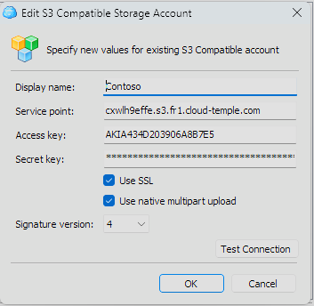
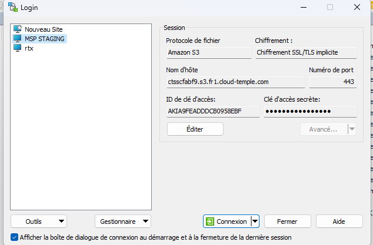
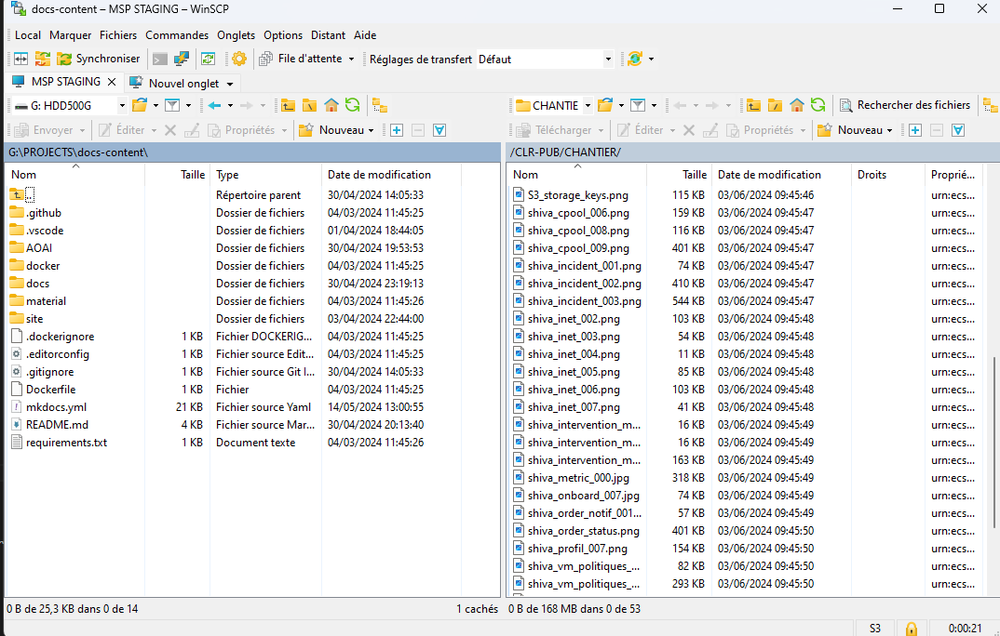

## Using MINIO

You can use the minio client, for example:

https://min.io/docs/minio/linux/reference/minio-mc.html

For example:
```
    mc alias set <alias_name> https://reks2ee2b1.s3.fr1.cloud-temple.com <access_key> <secret_key>
```
Push a file:
```
    mc cp test.txt <alias_name>/<bucket_name>
```
Retrieve a file:
```
    mc ls <alias_name>/<bucket_name>
```
#### Cloud Berry Explorer

You can also use [Cloud Berry Explorer](https://www.msp360.com/explorer/).

1. Connect using your endpoint and key:



2. Once connected, enter the bucket name in the navigation bar:


3. You can then use the bucket as usual:


## Using WINSCP 6.3.x

You can use [Winscp](https://winscp.net/eng/download.php):
1. Connect using your endpoint, access key, and secret key:



2. Once connected, use WINSCP as you would a normal FTP or SCP site:

